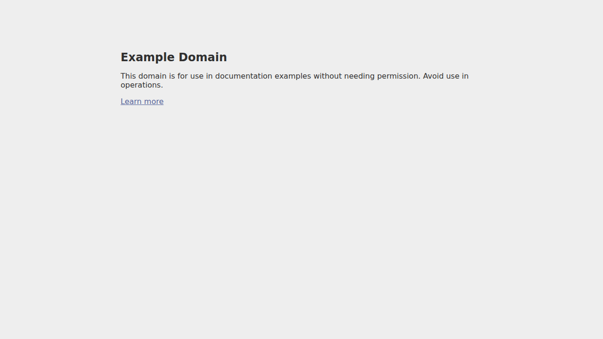
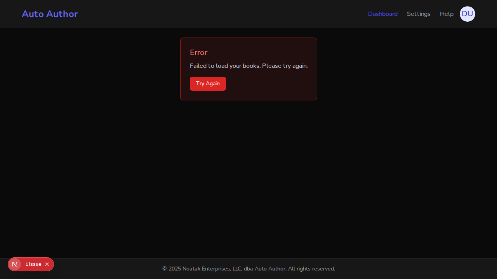

# Issue #184 — Open-redirect on sign-in hardened (PR #236)

*2026-07-07T02:21:18Z*

On `main`, `redirect` is the raw param passed straight to `router.push`. The branch routes it through `sanitizeRedirectPath`, which accepts only same-origin relative paths and otherwise falls back to `/dashboard`. The diff:

```bash
git diff main -- frontend/src/app/auth/sign-in/page.tsx
```

```output
diff --git a/frontend/src/app/auth/sign-in/page.tsx b/frontend/src/app/auth/sign-in/page.tsx
index 51ea5d0..219a799 100644
--- a/frontend/src/app/auth/sign-in/page.tsx
+++ b/frontend/src/app/auth/sign-in/page.tsx
@@ -3,6 +3,7 @@
 import { useState, Suspense } from "react";
 import { useRouter, useSearchParams } from "next/navigation";
 import { authClient } from "@/lib/auth-client";
+import { sanitizeRedirectPath } from "@/lib/security";
 import { Button } from "@/components/ui/button";
 import { Input } from "@/components/ui/input";
 import { Label } from "@/components/ui/label";
@@ -80,7 +81,9 @@ function getErrorMessage(error: { message?: string; code?: string } | null): str
 function SignInForm() {
   const router = useRouter();
   const searchParams = useSearchParams();
-  const redirect = searchParams.get("redirect") || "/dashboard";
+  // Only same-origin relative paths are honored; anything else falls back to
+  // /dashboard (open-redirect hardening, issue #184).
+  const redirect = sanitizeRedirectPath(searchParams.get("redirect"));
 
   const [email, setEmail] = useState("");
   const [password, setPassword] = useState("");
```

The new validator (real shipped code) run against the exact acceptance-criteria inputs plus a few edge cases:

```bash
cd frontend && npx tsx /tmp/claude-1000/-home-frankbria-projects-auto-author/6e1d40e7-22d1-4a5e-b95a-d3c161b53cca/scratchpad/probe.ts
```

```output
"https://evil.com"         -> /dashboard
"//evil.com"               -> /dashboard
"javascript:alert(1)"      -> /dashboard
"/%2F%2Fevil.com"          -> /dashboard
"/dashboard/books/123"     -> /dashboard/books/123
"/"                        -> /
null                       -> /dashboard
```

## Live sign-in — MAIN (vulnerable, port 3011)

Opened `http://localhost:3011/auth/sign-in?redirect=https://example.com/attacker-controlled` (example.com stands in as a safe attacker origin), filled the real credentials, and clicked **Sign In**.

```bash {image}
echo docs/demos/184-main-offsite.png
```



Outcome on `main`: the freshly-authenticated user was navigated **off-site** — the browser left `localhost` entirely and landed on `example.com/attacker-controlled`. Confirmed via `window.location.href`:

```
URL after sign-in on MAIN:  https://example.com/attacker-controlled
```

## Live sign-in — FIX BRANCH (port 3010)

Same malicious URL `http://localhost:3010/auth/sign-in?redirect=https://example.com/attacker-controlled`, same real credentials, same **Sign In** click.

```bash {image}
echo docs/demos/184-branch-dashboard.png
```



Outcome on the branch: the attacker origin is rejected and the user stays on the app, landing on the authenticated dashboard. Confirmed via `window.location.href`:

```
URL after sign-in on BRANCH:  http://localhost:3010/dashboard
```

(The dashboard shows a "Try Again" data-load state because the backend API on :8000 was not running for this demo — irrelevant to the redirect decision, which happens before any dashboard data fetch. The security-relevant fact is the origin: `localhost`, not `example.com`.)

## Acceptance criteria

| Criterion | Evidence |
|---|---|
| Only same-origin relative paths accepted; `//`, `://`, non-`/`-leading → `/dashboard` | Real validator run above; live branch sign-in stayed on `/dashboard` |
| Unit tests cover `//evil.com`, `https://evil.com`, `javascript:` | `security.test.ts` `sanitizeRedirectPath` suite + `SignInPage.test.tsx` (109 suites, 2019 passed) |
| Regression proof | Same malicious input redirected off-site on `main`, neutralized on the branch |
