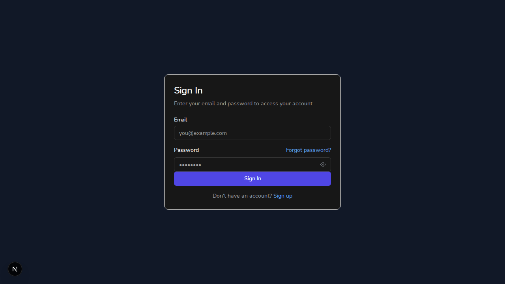
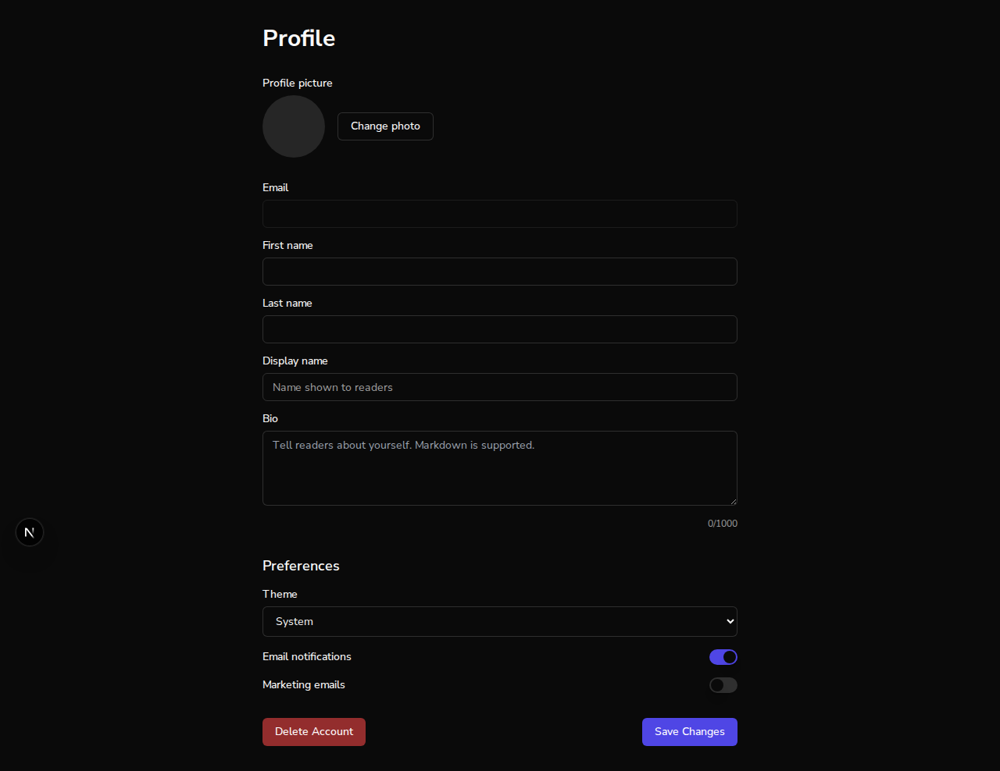

# Issue #185: /profile authentication guard — unauthenticated visitors are redirected to sign-in

*2026-07-07T03:27:03Z*

Setup: two real Next.js dev servers, no auth bypass. Port 3011 runs main (commit 1c4eb5b, pre-fix); port 3010 runs branch fix/185-profile-auth-guard (e01527d). Acceptance criteria: (1) /profile is protected — unauthenticated users redirect to sign-in; (2) a test covers the redirect. First, the bug on main: an unauthenticated request to /profile.

```bash
curl -s http://localhost:3011/profile -o /dev/null -w "HTTP %{http_code}\n"; echo "--- sensitive UI served in the response body:"; curl -s http://localhost:3011/profile | grep -ioE "profile picture|delete account" | sort -u
```

```output
HTTP 200
--- sensitive UI served in the response body:
Delete Account
Profile picture
profile picture
```

main returns HTTP 200 and serves the profile page — including the delete-account UI — to a visitor with no session cookie at all. That is the bug. Now the same request against the fix branch.

```bash
curl -s http://localhost:3010/profile -o /dev/null -w "HTTP %{http_code}\nLocation: %{redirect_url}\n"
```

```output
HTTP 307
Location: http://localhost:3010/auth/sign-in?redirect=%2Fprofile
```

The branch middleware answers 307 to /auth/sign-in?redirect=%2Fprofile before any profile HTML is served — and the deep link back to /profile survives sign-in via the #184 sanitizeRedirectPath validator. Confirm nothing sensitive leaks in the redirect response body, and that the /dashboard guard still works (regression):

```bash
echo "sensitive strings in branch /profile response body: $(curl -s http://localhost:3010/profile | grep -icoE "profile picture|delete account" | head -1)"; curl -s http://localhost:3010/dashboard -o /dev/null -w "/dashboard unauthenticated: HTTP %{http_code} -> %{redirect_url}\n"; curl -s http://localhost:3010/ -o /dev/null -w "/ (public landing):        HTTP %{http_code}\n"
```

```output
sensitive strings in branch /profile response body: 0
/dashboard unauthenticated: HTTP 307 -> http://localhost:3010/auth/sign-in?redirect=%2Fdashboard
/ (public landing):        HTTP 200
```

In a real browser: visiting /profile on the fix branch with no session lands on the sign-in page (note the ?redirect=%2Fprofile deep link in the URL bar).

```bash {image}
agent-browser screenshot /home/frankbria/projects/auto-author/docs/demos/185-branch-signin.png && echo /home/frankbria/projects/auto-author/docs/demos/185-branch-signin.png
```



Defense in depth: the middleware only checks that a session cookie EXISTS (it cannot validate the value at the edge). A forged cookie gets past it — on main the profile page then renders and stays; on the branch, the ProtectedRoute client guard validates the session for real and bounces the visitor to sign-in.

```bash
agent-browser open "http://localhost:3011/" >/dev/null && agent-browser eval "document.cookie=\"better-auth.session_token=forged-value; path=/\"" >/dev/null && agent-browser open "http://localhost:3011/profile" >/dev/null && sleep 4 && echo "MAIN   with forged cookie -> $(agent-browser get url)"
agent-browser open "http://localhost:3010/" >/dev/null && agent-browser eval "document.cookie=\"better-auth.session_token=forged-value; path=/\"" >/dev/null && agent-browser open "http://localhost:3010/profile" >/dev/null && sleep 4 && echo "BRANCH with forged cookie -> $(agent-browser get url)"
```

```output
MAIN   with forged cookie -> http://localhost:3011/profile
BRANCH with forged cookie -> http://localhost:3010/auth/sign-in
```

What the unauthenticated visitor actually sees on main — the full profile page with the Delete Account control:

```bash {image}
agent-browser screenshot --full /home/frankbria/projects/auto-author/docs/demos/185-main-exposed.png && echo /home/frankbria/projects/auto-author/docs/demos/185-main-exposed.png
```



Acceptance criterion 2: tests cover the redirect. Both new suites run against the real middleware and the real page component (ProtectedRoute unmocked):

```bash
cd /home/frankbria/projects/auto-author/frontend && npx jest src/__tests__/middleware.test.ts src/__tests__/ProfilePage.test.tsx --verbose 2>&1 | grep -E "✓|✕|Tests:|Test Suites:"
```

```output
    ✓ renders user profile data from Clerk (46 ms)
    ✓ updates all editable fields correctly (633 ms)
    ✓ validates form fields correctly (4 ms)
    ✓ saves and applies user preferences correctly (5 ms)
    ✓ uploads profile picture correctly (4 ms)
    ✓ handles account deletion correctly (3 ms)
    ✓ handles errors correctly (6 ms)
    ✓ redirects unauthenticated users to sign-in and hides the profile form (4 ms)
    ✓ shows a loading state (not the form) while the session is pending (3 ms)
    ✓ renders the profile form for an authenticated user (regression) (4 ms)
    ✓ redirects unauthenticated /profile to sign-in with redirect param (3 ms)
    ✓ allows /profile through with a session cookie (1 ms)
    ✓ allows /profile through with the production (HTTPS) session cookie (1 ms)
    ✓ still redirects unauthenticated /dashboard (regression)
    ✓ leaves public routes alone without a session (1 ms)
Test Suites: 2 passed, 2 total
Tests:       15 passed, 15 total
```

Summary: on main, unauthenticated GET /profile returned 200 with the full profile page (delete-account UI included), and even a forged cookie kept the page rendered. On the fix branch, the middleware answers 307 to /auth/sign-in?redirect=%2Fprofile before any profile HTML is served, the ProtectedRoute client guard catches forged/expired sessions, /dashboard protection and the public landing page are unchanged, and 15 tests pin both layers. Both acceptance criteria verified with live servers.
