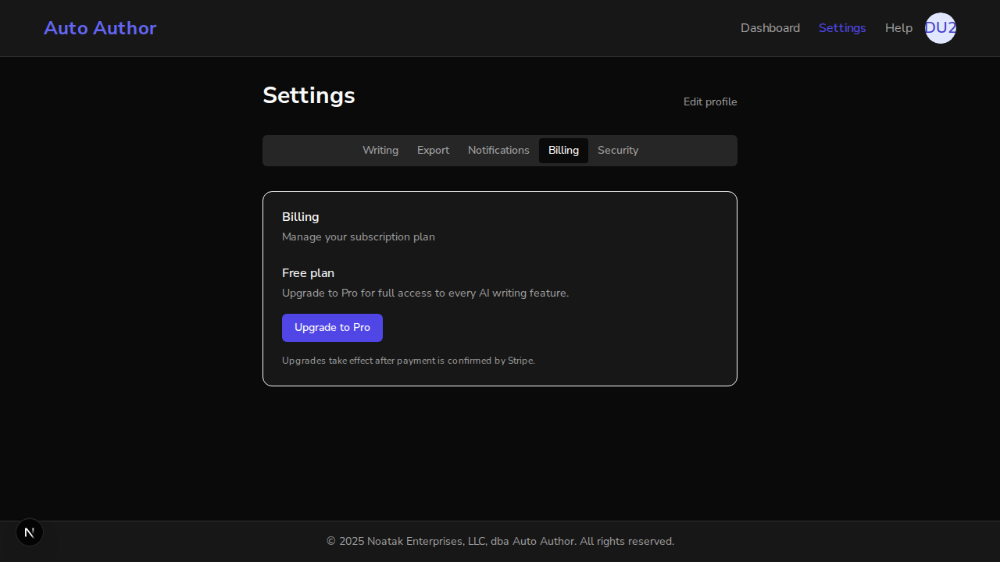
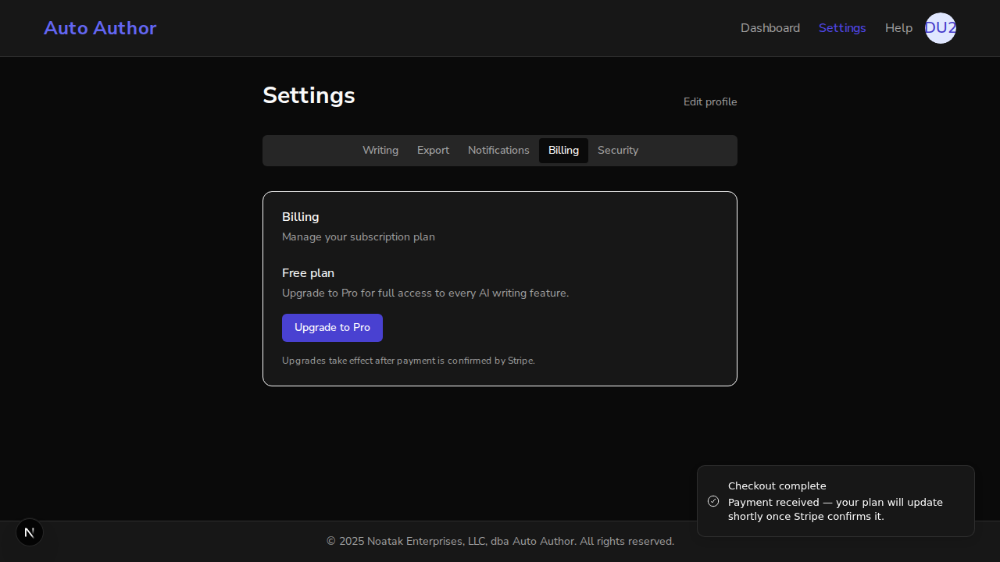
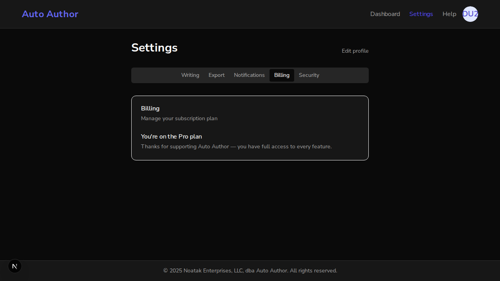

# Issue #221 — Stripe checkout flow for plan upgrade (free → pro)

*2026-07-09T18:19:46Z*

Setup: the REAL backend (uvicorn, branch build) and REAL frontend (next dev) run against the REAL local MongoDB. The only stub is at the outermost wire boundary: stripe.api_base points the genuine stripe-python SDK at a local HTTP stub that logs every request it receives verbatim (path, Idempotency-Key header, form-encoded params) — so everything shown below, including SDK serialization, is exactly what would reach Stripe. Demo Stripe env: STRIPE_SECRET_KEY=sk_test_demo, STRIPE_PRICE_ID_PRO=price_pro_demo221, STRIPE_WEBHOOK_SECRET=whsec_demo221. A real user account is created through the actual better-auth signup flow in a real browser.

Act 1 — the starting state. A brand-new user was just created through the real better-auth signup UI (screenshots later come from that same browser session). The backend sees them on the free plan with no Stripe linkage. All curl calls below authenticate with the REAL session cookie better-auth issued at signup.

```bash
curl -s -b "better-auth.session_token=$(cat /tmp/claude-1000/-home-frankbria-projects-auto-author/7e46dff8-77f8-4eb7-8284-f2ca7130d0a4/scratchpad/demo/token.txt)" http://localhost:8000/api/v1/users/me | python3 -c 'import json,sys; u=json.load(sys.stdin); print(json.dumps({k:u[k] for k in ("email","plan","stripe_customer_id","stripe_subscription_id")}, indent=2))'
```

```output
{
  "email": "issue221-demo@example.com",
  "plan": "free",
  "stripe_customer_id": null,
  "stripe_subscription_id": null
}
```

Act 2 — fail-closed. A second instance of the same build runs on port 8001 with STRIPE_SECRET_KEY unset. Checkout refuses to talk to Stripe half-configured (the same 503 convention as the #220 webhook), even for a fully authenticated user.

```bash
curl -s -w '\nHTTP %{http_code}\n' -b "better-auth.session_token=$(cat /tmp/claude-1000/-home-frankbria-projects-auto-author/7e46dff8-77f8-4eb7-8284-f2ca7130d0a4/scratchpad/demo/token.txt)" -H 'Content-Type: application/json' -d '{"plan":"pro"}' http://localhost:8001/api/v1/billing/checkout
```

```output
{"detail":"Stripe checkout is not configured"}
HTTP 503
```

Act 3 — starting checkout for real. Against the configured backend (port 8000), the same authenticated POST returns a Stripe-hosted checkout URL. (In this demo the wire stub hands back the success return URL as the "hosted page" so the browser act can complete the round trip.)

```bash
curl -s -w '\nHTTP %{http_code}\n' -b "better-auth.session_token=$(cat /tmp/claude-1000/-home-frankbria-projects-auto-author/7e46dff8-77f8-4eb7-8284-f2ca7130d0a4/scratchpad/demo/token.txt)" -H 'Content-Type: application/json' -d '{"plan":"pro"}' http://localhost:8000/api/v1/billing/checkout
```

```output
{"url":"http://localhost:3000/dashboard/settings?checkout=success"}
HTTP 200
```

What actually went over the wire to Stripe — logged verbatim by the stub as the real SDK serialized it. Note the three linkage guarantees: (1) the Customer carries metadata.auth_id and an idempotency key derived from the user (a double-click race cannot mint two customers); (2) the subscription-mode Session is pinned to the configured pro price; (3) client_reference_id and subscription_data.metadata.auth_id are stamped — exactly the fallback the #220 webhook uses to find this user.

```bash
cat /tmp/claude-1000/-home-frankbria-projects-auto-author/7e46dff8-77f8-4eb7-8284-f2ca7130d0a4/scratchpad/demo/stripe_wire.log | python3 -c 'import json,sys
for line in sys.stdin: print(json.dumps(json.loads(line), indent=2))'
```

```output
{
  "path": "/v1/customers",
  "idempotency_key": "checkout-customer-6a4fe667b528c64cffdbf57d",
  "params": {
    "email": "issue221-demo@example.com",
    "metadata[auth_id]": "6a4fe667b528c64cffdbf57d"
  }
}
{
  "path": "/v1/checkout/sessions",
  "idempotency_key": "c471e0bb-f0e2-44af-bdf7-f25e7df8ffa1",
  "params": {
    "mode": "subscription",
    "customer": "cus_demo_221",
    "line_items[0][price]": "price_pro_demo221",
    "line_items[0][quantity]": "1",
    "client_reference_id": "6a4fe667b528c64cffdbf57d",
    "subscription_data[metadata][auth_id]": "6a4fe667b528c64cffdbf57d",
    "success_url": "http://localhost:3000/dashboard/settings?checkout=success",
    "cancel_url": "http://localhost:3000/dashboard/settings?checkout=cancel"
  }
}
```

Act 4 — persistence and reuse. The user record now carries the Stripe customer id (plan still free — checkout never flips it). A second checkout call reuses that customer: the wire log gains one more /v1/checkout/sessions entry but NO second /v1/customers.

```bash
mongosh auto_author --quiet --eval 'const u = db.users.findOne({email: "issue221-demo@example.com"}); printjson({plan: u.plan, stripe_customer_id: u.stripe_customer_id, stripe_subscription_id: u.stripe_subscription_id})'
```

```output
{
  plan: 'free',
  stripe_customer_id: 'cus_demo_221',
  stripe_subscription_id: undefined
}
```

```bash
curl -s -o /dev/null -w 'HTTP %{http_code}\n' -b "better-auth.session_token=$(cat /tmp/claude-1000/-home-frankbria-projects-auto-author/7e46dff8-77f8-4eb7-8284-f2ca7130d0a4/scratchpad/demo/token.txt)" -H 'Content-Type: application/json' -d '{"plan":"pro"}' http://localhost:8000/api/v1/billing/checkout && awk -F'"' '{print $4}' /tmp/claude-1000/-home-frankbria-projects-auto-author/7e46dff8-77f8-4eb7-8284-f2ca7130d0a4/scratchpad/demo/stripe_wire.log | sort | uniq -c
```

```output
HTTP 200
      2 /v1/checkout/sessions
      1 /v1/customers
```

Act 5 — the user-facing entry point (AC: "authenticated user can start checkout"). In the same real browser session, the dashboard settings page now has a Billing tab showing the current plan and an Upgrade button.

```bash {image}
agent-browser screenshot docs/demos/issue221-billing-tab-free.png >/dev/null 2>&1; echo docs/demos/issue221-billing-tab-free.png
```



Clicking "Upgrade to Pro" calls POST /billing/checkout and the browser is redirected to the returned Stripe URL (which, via the demo stub, is the checkout=success return route). The page lands back on the settings Billing tab with the success toast — and the toast copy is explicit that the plan updates only once Stripe confirms.

```bash {image}
echo docs/demos/issue221-checkout-success.png
```



The URL bar confirms the ?checkout=success param was stripped after handling (a refresh cannot re-fire the toast), and the Billing tab is active with the success toast visible. The plan is still free — the redirect is informational only.

Act 6 — completing the purchase (AC: "on completion their plan reflects the purchased tier (via webhook)"). Stripe would deliver customer.subscription.created after payment. We send that event with a REAL HMAC signature (stdlib hmac, the exact t=...,v1=... scheme) to the live #220 webhook. It finds the user by the stripe_customer_id that checkout just linked and flips the plan.

Bonus finding: the first run of this act exposed a pre-existing #220 drift — /users/me built its response field-by-field and dropped the stripe ids (always null even when persisted). Fixed in this PR with a regression test; the backend below is the patched build.

```bash
python3 /tmp/claude-1000/-home-frankbria-projects-auto-author/7e46dff8-77f8-4eb7-8284-f2ca7130d0a4/scratchpad/demo/send_signed_webhook.py evt_demo_221_003 && curl -s -b "better-auth.session_token=$(cat /tmp/claude-1000/-home-frankbria-projects-auto-author/7e46dff8-77f8-4eb7-8284-f2ca7130d0a4/scratchpad/demo/token.txt)" http://localhost:8000/api/v1/users/me | python3 -c 'import json,sys; u=json.load(sys.stdin); print(json.dumps({k:u[k] for k in ("plan","stripe_customer_id","stripe_subscription_id")}, indent=2))'
```

```output
200 {"status":"processed","plan":"pro"}
{
  "plan": "pro",
  "stripe_customer_id": "cus_demo_221",
  "stripe_subscription_id": "sub_demo_221"
}
```

Act 7 — the UI reflects the purchased tier. Reloading the settings Billing tab in the same browser session now shows the Pro state with no Upgrade button.

```bash {image}
agent-browser screenshot docs/demos/issue221-billing-tab-pro.png >/dev/null 2>&1; echo docs/demos/issue221-billing-tab-pro.png
```



Act 8 — no double-purchase. Now that the user is on a paid plan, another checkout attempt is rejected with 409 and nothing is sent to Stripe.

```bash
curl -s -w '\nHTTP %{http_code}\n' -b "better-auth.session_token=$(cat /tmp/claude-1000/-home-frankbria-projects-auto-author/7e46dff8-77f8-4eb7-8284-f2ca7130d0a4/scratchpad/demo/token.txt)" -H 'Content-Type: application/json' -d '{"plan":"pro"}' http://localhost:8000/api/v1/billing/checkout && echo '--- wire log request count by path:' && awk -F'"' '{print $4}' /tmp/claude-1000/-home-frankbria-projects-auto-author/7e46dff8-77f8-4eb7-8284-f2ca7130d0a4/scratchpad/demo/stripe_wire.log | sort | uniq -c
```

```output
{"detail":"You are already on a paid plan"}
HTTP 409
--- wire log request count by path:
      3 /v1/checkout/sessions
      1 /v1/customers
```

The wire log ends at 3 sessions (two curl checkouts in Acts 3-4 plus the browser Upgrade click in Act 5 — the UI click genuinely reached the Stripe boundary) and still exactly 1 customer. The 409 above added nothing.

Summary: an authenticated user started checkout from the settings Billing tab (AC 1); the session carried the auth_id linkage; the genuinely HMAC-signed subscription webhook flipped the plan to the purchased tier (AC 2), which both the API and the UI reflect; fail-closed 503, customer reuse, param-stripped return handling, and 409 double-purchase protection all shown against the real app, real Mongo, and the real stripe-python SDK with only the outermost HTTP hop stubbed.
