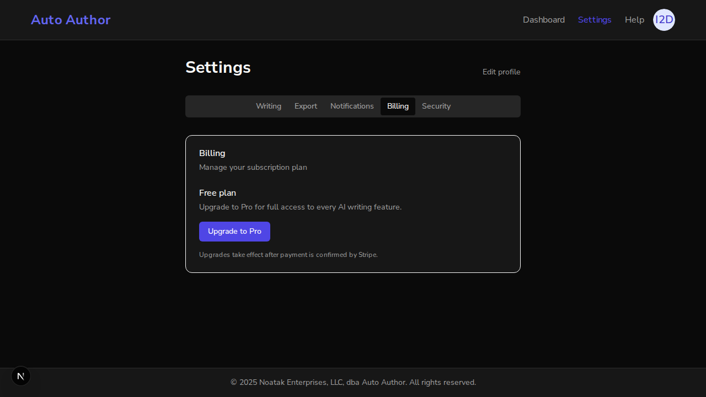
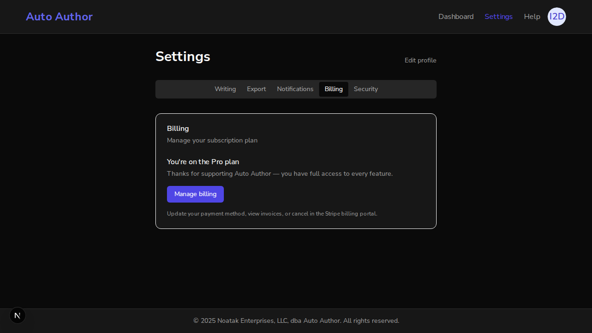
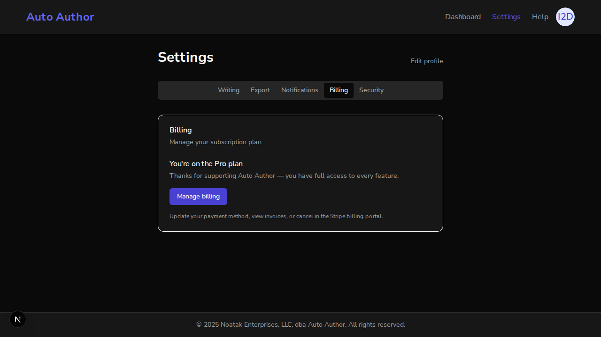
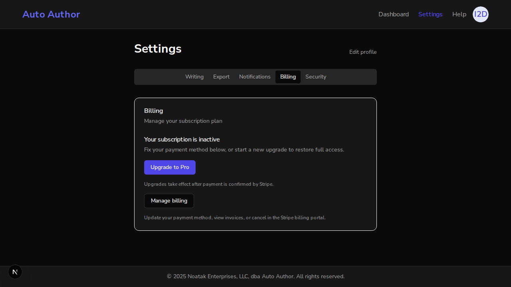
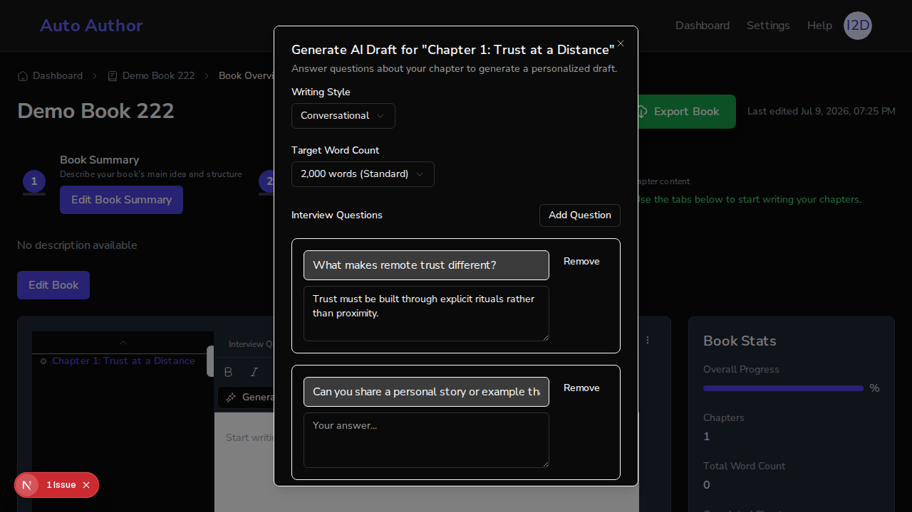

# Issue #222 — Billing settings UI: Stripe portal + billing-tab deep link

*2026-07-09T19:17:47Z*

Setup mirrors the #221 demo: the REAL backend (uvicorn, branch build) and REAL frontend (next dev) run against the REAL local MongoDB, with a real better-auth user created through the actual signup UI. The only stub is at the outermost wire boundary: stripe.api_base points the genuine stripe-python SDK at a local HTTP stub that logs every request verbatim and hands the submitted return_url back as the "hosted portal page" so the browser can complete the round trip. Demo env: STRIPE_SECRET_KEY=sk_test_demo, STRIPE_PRICE_ID_PRO=price_pro_demo222.

What this PR adds on top of #221: POST /api/v1/billing/portal (Stripe billing-portal session — gated on having a Stripe customer, NOT on plan, so lapsed users can fix payment), a Manage-billing button for users with a billing account, ?tab= deep links on the settings page, and the entitlement Upgrade CTA now targeting the Billing tab.

Act 1 — a brand-new user (created moments ago through the real better-auth signup UI) opens the deep link /dashboard/settings?tab=billing. Before this PR the ?tab= param was ignored and the page always opened on Writing; now the Billing tab is selected on load. As a free user with no Stripe customer they see only the Upgrade CTA — no Manage billing button.

```bash {image}
agent-browser screenshot docs/demos/issue222-deeplink-free.png >/dev/null 2>&1 && echo docs/demos/issue222-deeplink-free.png
```



The accessibility tree confirms it: tab "Billing" [selected] straight from the URL, and the only billing action offered to a free user is "Upgrade to Pro". An unknown ?tab= value fails safe to the default tab (pinned by unit test).

Act 2 — the guard rails, using the REAL session cookie better-auth issued at signup. A free user with no Stripe customer has nothing to manage: the portal answers 409 without ever talking to Stripe. Unauthenticated callers get 401.

```bash
curl -s -X POST http://localhost:8000/api/v1/billing/portal -H "Cookie: $(cat /tmp/claude-1000/-home-frankbria-projects-auto-author/fb68e2e1-16a7-43af-a3ae-2aded794407a/scratchpad/cookie.txt)" -w "\nHTTP %{http_code}\n"
```

```output
{"detail":"No billing account yet — upgrade to a paid plan first"}
HTTP 409
```

```bash
curl -s -X POST http://localhost:8000/api/v1/billing/portal -o /dev/null -w "no cookie -> HTTP %{http_code}\n"
```

```output
no cookie -> HTTP 401
```

Act 3 — fail-closed. A second instance of the same backend (port 8010) runs with STRIPE_SECRET_KEY unset: the portal refuses with 503 rather than talking to Stripe half-configured — the same convention as the #220 webhook and #221 checkout.

```bash
curl -s -X POST http://localhost:8010/api/v1/billing/portal -H "Cookie: $(cat /tmp/claude-1000/-home-frankbria-projects-auto-author/fb68e2e1-16a7-43af-a3ae-2aded794407a/scratchpad/cookie.txt)" -w "\nHTTP %{http_code}\n"
```

```output
{"detail":"Stripe billing is not configured"}
HTTP 503
```

Act 4 — a paying user manages billing. The user's plan flip to pro + Stripe customer linkage is applied directly in Mongo here (the #221 demo already proved the genuinely HMAC-signed webhook performs exactly this write; re-proving it is not this PR's job).

```bash
mongosh auto_author --quiet --eval "db.users.updateOne({email: \"issue222-demo@example.com\"}, {\$set: {plan: \"pro\", stripe_customer_id: \"cus_demo222_paid\"}}); const u = db.users.findOne({email: \"issue222-demo@example.com\"}); printjson({plan: u.plan, stripe_customer_id: u.stripe_customer_id})"
```

```output
{
  plan: 'pro',
  stripe_customer_id: 'cus_demo222_paid'
}
```

The same deep link now renders the Pro state: "Manage billing" replaces the Upgrade CTA.

```bash {image}
agent-browser screenshot docs/demos/issue222-billing-tab-pro.png >/dev/null 2>&1 && echo docs/demos/issue222-billing-tab-pro.png
```



Clicking "Manage billing" called POST /api/v1/billing/portal, the genuine stripe-python SDK created a billing-portal session, and the browser followed the returned portal URL. What actually went over the wire to Stripe — logged verbatim by the stub: the customer is the session user's own linkage (never taken from the request body — no IDOR surface) and the return_url is server-built to land back on the Billing tab.

```bash
cat /tmp/claude-1000/-home-frankbria-projects-auto-author/fb68e2e1-16a7-43af-a3ae-2aded794407a/scratchpad/stripe-stub/stripe-wire.log
```

```output
{
  "method": "POST",
  "path": "/v1/billing_portal/sessions",
  "idempotency_key": "dbd86d39-da0b-43bf-b059-59214bcb3102",
  "params": {
    "customer": "cus_demo222_paid",
    "return_url": "http://localhost:3000/dashboard/settings?tab=billing"
  }
}
```

The stub hands the return_url back as the "hosted portal page", so the browser round-trips exactly the path a real user takes after closing the portal: it lands on /dashboard/settings?tab=billing with the Billing tab selected.

```bash {image}
agent-browser screenshot docs/demos/issue222-portal-roundtrip.png >/dev/null 2>&1 && echo docs/demos/issue222-portal-roundtrip.png
```



Act 5 — the lapsed-subscriber recovery flow (the pre-PR review's Major finding, now fixed). When a card fails, the webhook moves the user to the restricted plan. The Manage-billing gate is the Stripe customer, NOT the plan — so a restricted user sees BOTH a fresh-upgrade path and the portal to fix their payment method, with honest copy instead of a misleading "Free plan" label.

```bash
mongosh auto_author --quiet --eval "db.users.updateOne({email: \"issue222-demo@example.com\"}, {\$set: {plan: \"restricted\"}}); const u = db.users.findOne({email: \"issue222-demo@example.com\"}); printjson({plan: u.plan, stripe_customer_id: u.stripe_customer_id})"
```

```output
{
  plan: 'restricted',
  stripe_customer_id: 'cus_demo222_paid'
}
```

```bash {image}
agent-browser screenshot docs/demos/issue222-restricted-both-buttons.png >/dev/null 2>&1 && echo docs/demos/issue222-restricted-both-buttons.png
```



The restricted user sees "Your subscription is inactive" with BOTH "Upgrade to Pro" and "Manage billing" — the recovery flow the backend deliberately allows (portal gate = customer id; checkout blocks only already-pro). Verified in-page: document.body.innerText contains the inactive-subscription copy.

Act 6 — the entitlement CTA deep link. The restricted plan has no AI entitlements (#174), so an AI call answers 402 ENTITLEMENT_REQUIRED. On the wire (a book owned by this restricted user):

```bash
curl -s -X POST "http://localhost:8000/api/v1/books/$(cat /tmp/claude-1000/-home-frankbria-projects-auto-author/fb68e2e1-16a7-43af-a3ae-2aded794407a/scratchpad/bookid.txt)/analyze-summary" -H "Cookie: $(cat /tmp/claude-1000/-home-frankbria-projects-auto-author/fb68e2e1-16a7-43af-a3ae-2aded794407a/scratchpad/cookie.txt)" -H "Content-Type: application/json" -d "{\"summary\": \"A sufficiently long book summary about leadership in distributed teams for demo purposes.\"}" -w "\nHTTP %{http_code}\n" -D - -o /dev/null 2>/dev/null | grep -iE "HTTP|x-entitlement"; curl -s -X POST "http://localhost:8000/api/v1/books/$(cat /tmp/claude-1000/-home-frankbria-projects-auto-author/fb68e2e1-16a7-43af-a3ae-2aded794407a/scratchpad/bookid.txt)/analyze-summary" -H "Cookie: $(cat /tmp/claude-1000/-home-frankbria-projects-auto-author/fb68e2e1-16a7-43af-a3ae-2aded794407a/scratchpad/cookie.txt)" -H "Content-Type: application/json" -d "{\"summary\": \"A sufficiently long book summary about leadership in distributed teams for demo purposes.\"}"
```

```output
HTTP/1.1 402 Payment Required
x-entitlement-plan: restricted
x-entitlement-feature: analyze_summary
content-security-policy: default-src 'self'; script-src 'self' 'unsafe-inline' https://cdn.jsdelivr.net; style-src 'self' 'unsafe-inline' https://cdn.jsdelivr.net; img-src 'self' data: https://fastapi.tiangolo.com; connect-src 'self'; frame-src 'self'; font-src 'self' data: https://r2cdn.perplexity.ai;
HTTP 402
{"detail":{"error":"Your plan does not include this feature.","error_code":"ENTITLEMENT_REQUIRED","status_code":402,"details":[{"field":"plan","message":"The 'restricted' plan is not entitled to 'analyze_summary'.","code":"ENTITLEMENT_REQUIRED","value":"restricted"}],"timestamp":"2026-07-09T19:24:23.230754Z","request_id":"req_fe83f5301178","help_url":null}}```
```

```bash {image}
agent-browser screenshot docs/demos/issue222-draft-402-inline.png >/dev/null 2>&1 && echo docs/demos/issue222-draft-402-inline.png
```



Demo finding (pre-existing, not a regression of this PR): driving the two main AI flows as a restricted user in the real browser shows that neither surfaces the ENTITLEMENT toast — the TOC wizard renders its own inline "Something Went Wrong / Try Again" panel and the draft dialog shows an inline "Generation Failed" that leaks the raw 402 JSON payload (screenshot above). The showErrorNotification ENTITLEMENT branch (whose Upgrade CTA this PR retargets to ?tab=billing) is exercised by the aiErrorHandler pipeline and pinned by unit test, but no shipped flow currently routes a 402 through it. Filed as a follow-up issue. The CTA target change itself is verified by the ErrorNotification unit test:

```bash
cd frontend && npx jest src/components/errors/__tests__/ErrorNotification.test.tsx -t "deep-links" 2>&1 | grep -E "✓|✗|Tests:"
```

```output
    ✓ Upgrade CTA deep-links to the billing settings tab (issue #222) (1 ms)
Tests:       56 skipped, 1 passed, 57 total
```

Summary — all issue #222 ACs demonstrated against the real app, real Mongo, real better-auth session, and the real stripe-python SDK with only the outermost HTTP hop stubbed: the user sees their plan on the Billing tab in all three states (free / pro / restricted); a free user gets the Upgrade CTA and a 409 if they call the portal directly; a paying user clicks Manage billing and round-trips through a genuine billing-portal session (wire log shows customer + return_url) back to the Billing tab; ?tab=billing deep links select the tab on load; unset STRIPE_SECRET_KEY fails closed with 503; the entitlement Upgrade CTA target is pinned by unit test, and the discovery that no shipped flow currently routes a 402 through that toast is filed as issue #247.
