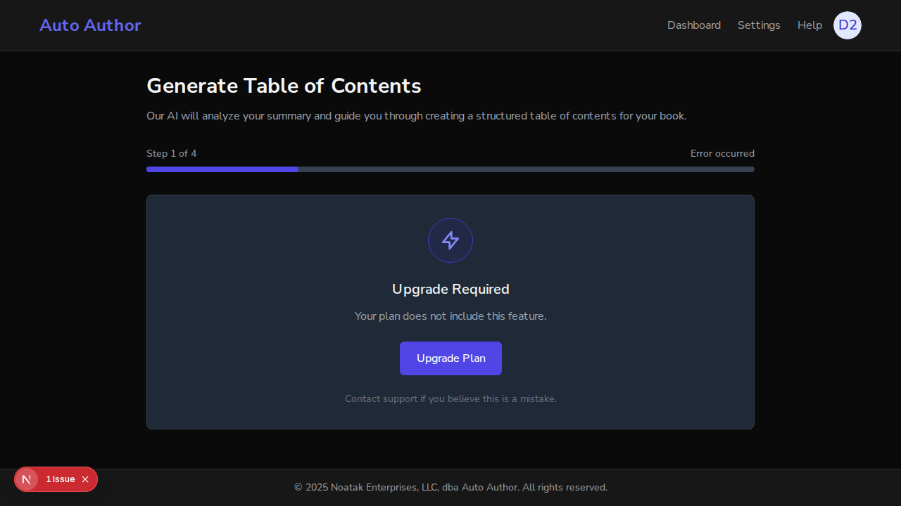
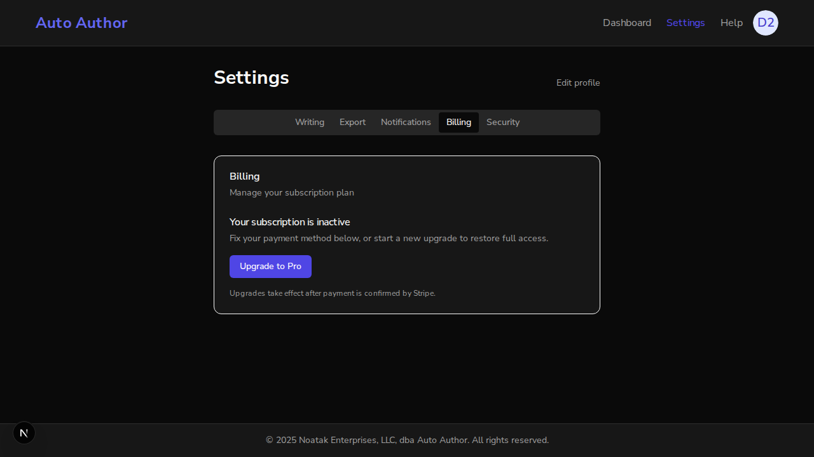
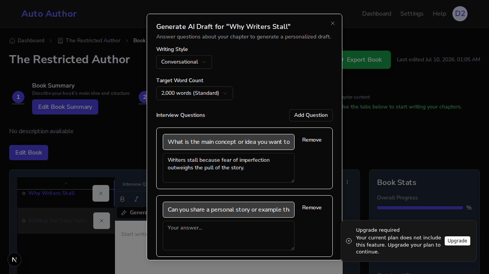

# Issue #247 — Entitlement 402s reach the Upgrade CTA (wizard panel + draft toast, no raw JSON)

*2026-07-10T01:08:01Z*

Setup: the REAL backend (uvicorn, PR #248 branch) and REAL frontend (next dev) against the REAL local MongoDB. The demo user was created moments ago through the actual better-auth signup UI, then flipped to the `restricted` plan directly in Mongo — the #174 entitlement gate denies every AI feature to that plan with a structured 402, so no AI/OpenAI stubbing is needed: the paywall fires before any AI call. A book with a summary and a two-chapter TOC is seeded for the user.

```bash
mongosh auto_author --quiet --eval "const u = db.users.findOne({email: \"issue247-demo@example.com\"}); printjson({email: u.email, plan: u.plan})"
```

```output
{
  email: 'issue247-demo@example.com',
  plan: 'restricted'
}
```

Act 1 — what the backend actually sends. Using the REAL session cookie better-auth issued at signup, the analyze-summary endpoint answers the restricted user with the structured 402. This JSON blob is exactly what leaked verbatim into the draft dialog before this PR (screenshot evidence in the #222 demo, `issue222-draft-402-inline.png`).

```bash
curl -s -X POST http://localhost:8000/api/v1/books/6a5045574b162fbc33091f35/analyze-summary -H "Cookie: $(cat /tmp/claude-1000/-home-frankbria-projects-auto-author/f51a1090-4eb9-4a4b-9086-7791fda893a7/scratchpad/cookie.txt)" -H "Content-Type: application/json" -d "{}" -w "\nHTTP %{http_code}\n"
```

```output
{"detail":{"error":"Your plan does not include this feature.","error_code":"ENTITLEMENT_REQUIRED","status_code":402,"details":[{"field":"plan","message":"The 'restricted' plan is not entitled to 'analyze_summary'.","code":"ENTITLEMENT_REQUIRED","value":"restricted"}],"timestamp":"2026-07-10T01:08:31.217346Z","request_id":"req_bde402f9610b","help_url":null}}
HTTP 402
```

Act 2 — the TOC wizard. Before this PR, this exact 402 was silently swallowed by the nested analyze-summary catch and the wizard fell through to a generic flow; any surfaced 402 got the full-panel "Something Went Wrong / Try Again" — useless for a paywall. Now the wizard routes it to an Upgrade Required panel deep-linking to the Billing settings tab.

```bash {image}
agent-browser screenshot docs/demos/issue247-wizard-upgrade-panel.png >/dev/null 2>&1 && echo docs/demos/issue247-wizard-upgrade-panel.png
```



DOM assertions on the live page: the panel headline is "Upgrade Required", the affordance is a real link to /dashboard/settings?tab=billing, and there is no "Try Again" and no raw payload fragment anywhere on the page.

```bash
agent-browser get text h2; agent-browser eval "document.querySelector(\"a[href='/dashboard/settings?tab=billing']\")?.textContent"; echo "Try Again present: $(agent-browser eval "document.body.innerText.includes(\"Try Again\")")"; echo "raw payload present: $(agent-browser eval "document.body.innerText.includes(\"detail\") || document.body.innerText.includes(\"ENTITLEMENT_REQUIRED\")")"
```

```output
Upgrade Required
"Upgrade Plan"
Try Again present: false
raw payload present: false
```

Clicking Upgrade Plan lands on the settings page with the Billing tab pre-selected (the ?tab= deep link shipped in #246).

```bash {image}
agent-browser screenshot docs/demos/issue247-billing-after-upgrade-click.png >/dev/null 2>&1 && echo docs/demos/issue247-billing-after-upgrade-click.png
```



```bash
agent-browser eval "document.querySelector(\"[role=tab][aria-selected=true]\")?.textContent"
```

```output
"Billing"
```

Act 3 — the draft dialog (the raw-JSON leak). Before this PR, `generateChapterDraft` built its error from `response.text()`, so the dialog toasted `Generation Failed: Failed to generate draft: 402 {"detail":{...}}` — the whole payload, verbatim. Now the call goes through the shared error-handling wrapper: the 402 fires the classified ENTITLEMENT toast with its own Upgrade action, and the dialog quietly returns to the form. Open the chapter editor, answer an interview question, and generate:

```bash {image}
agent-browser screenshot docs/demos/issue247-draft-402-upgrade-toast.png >/dev/null 2>&1 && echo docs/demos/issue247-draft-402-upgrade-toast.png
```



```bash
echo "Upgrade toast action present: $(agent-browser eval "[...document.querySelectorAll(\"button\")].some(b => b.textContent.trim() === \"Upgrade\")")"; echo "raw payload in DOM: $(agent-browser eval "document.body.innerText.includes(\"detail\") || document.body.innerText.includes(\"402\") || document.body.innerText.includes(\"Failed to generate draft:\")")"; echo "old Generation Failed toast present: $(agent-browser eval "document.body.innerText.includes(\"Generation Failed\")")"
```

```output
Upgrade toast action present: true
raw payload in DOM: false
old Generation Failed toast present: false
```

The classified ENTITLEMENT toast (with its Upgrade action) is on screen, the dialog returned to the form, and — the point of the issue — no fragment of the raw 402 payload and no "Generation Failed" raw-message toast appears anywhere in the DOM. Every acceptance criterion of #247 is met: the wizard surfaces an inline upgrade affordance deep-linking to /dashboard/settings?tab=billing, the draft flow routes its 402 through the shared Upgrade CTA, and raw payloads never render.
