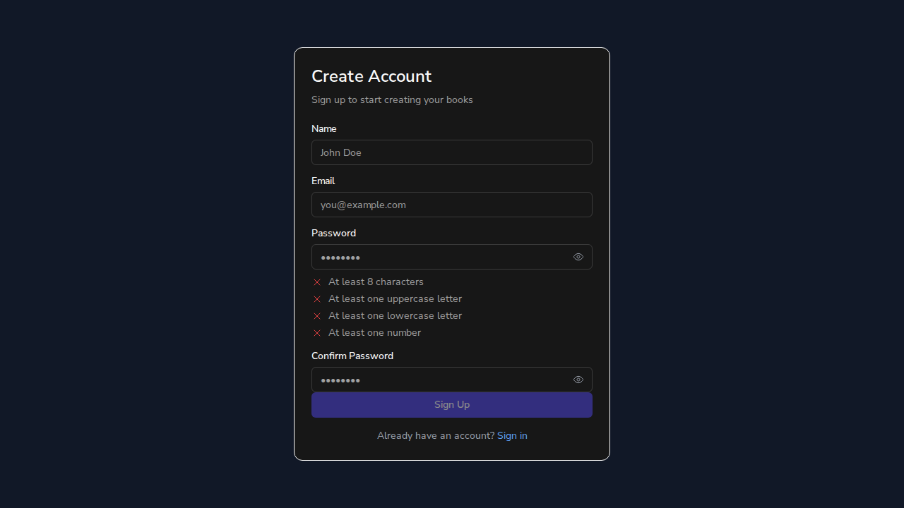
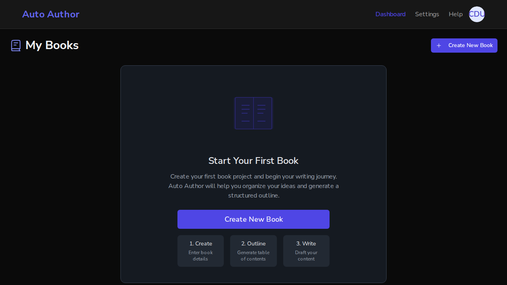

# Issue #190: nonce-based CSP replaces unsafe-inline/unsafe-eval and dead Clerk origins

*2026-07-11T02:23:06Z*

The frontend shipped a static CSP whose script-src included unsafe-inline and unsafe-eval — neutering CSP as an XSS mitigation in an app that renders AI/user-derived HTML — plus origins for Clerk (removed from the app 2025-12), a Clerk-era Cloudflare captcha, a pre-migration API domain, unused font CDNs, and localhost:8000/wss: in production connect-src. The fix moves the CSP into middleware with a per-request nonce + strict-dynamic (the official Next.js pattern) and derives connect-src from NEXT_PUBLIC_API_URL. Two production builds are running: main on port 3010 (before) and the fix branch on port 3000 (after), with the real FastAPI backend on port 8000 and a real local MongoDB. BEFORE — main production build, the header as deployed today:

```bash
curl -sI http://localhost:3010/ | grep -i "^content-security-policy" | tr ";" "\n" | sed "s/^ //" | tr -d "\r"
```

```output
Content-Security-Policy: default-src 'self'
script-src 'self' 'unsafe-eval' 'unsafe-inline' https://clerk.auto-author.dev https://*.clerk.accounts.dev https://challenges.cloudflare.com
style-src 'self' 'unsafe-inline' https://fonts.googleapis.com
font-src 'self' https://fonts.gstatic.com https://r2cdn.perplexity.ai data:
img-src 'self' data: https: blob:
media-src 'self'
connect-src 'self' https://clerk.auto-author.dev https://*.clerk.accounts.dev https://api.auto-author.dev https://api.dev.autoauthor.app https://clerk-telemetry.com https://dev.autoauthor.app http://localhost:8000 https://localhost:8000 wss:
frame-src 'self' https://*.clerk.accounts.dev
worker-src 'self' blob:
object-src 'none'
base-uri 'self'
form-action 'self'
frame-ancestors 'none'
upgrade-insecure-requests
```

script-src trusts unsafe-inline + unsafe-eval + three dead third-party origins; connect-src ships localhost:8000, wss:, two Clerk hosts, clerk-telemetry, and the pre-migration api.auto-author.dev — in a production artifact. AFTER — the branch production build (built with the same NEXT_PUBLIC_API_URL=http://localhost:8000/api/v1 the CI E2E uses). script-src is nonce + strict-dynamic with no unsafe-*, every dead origin is gone, and connect-src is exactly self + the configured API origin:

```bash
curl -sI http://localhost:3000/ | grep -i "^content-security-policy" | sed -E "s/nonce-[A-Za-z0-9+\/=]+/nonce-<per-request-value>/" | tr ";" "\n" | sed "s/^ //" | tr -d "\r"
```

```output
content-security-policy: default-src 'self'
script-src 'self' 'nonce-<per-request-value>' 'strict-dynamic'
style-src 'self' 'unsafe-inline'
font-src 'self' data:
img-src 'self' data: https: blob:
media-src 'self'
connect-src 'self' http://localhost:8000
worker-src 'self' blob:
object-src 'none'
base-uri 'self'
form-action 'self'
frame-ancestors 'none'
upgrade-insecure-requests
```

The nonce is generated fresh per request, and Next.js stamps every script it emits — external chunks and inline bootstrap scripts alike — with that request's nonce. Deterministic checks: two consecutive responses carry different nonces; in one served page, zero script tags lack a nonce:

```bash
n1=$(curl -sI http://localhost:3000/ | grep -io "nonce-[A-Za-z0-9+/=]*" | head -1); n2=$(curl -sI http://localhost:3000/ | grep -io "nonce-[A-Za-z0-9+/=]*" | head -1); [ -n "$n1" ] && [ "$n1" != "$n2" ] && echo "two requests, two nonces: DIFFERENT (as designed)"; html=$(curl -s http://localhost:3000/); total=$(echo "$html" | grep -o "<script[^>]*" | wc -l); with_nonce=$(echo "$html" | grep -o "<script[^>]*" | grep -c nonce); echo "script tags: $total total, $with_nonce carry the nonce, $((total-with_nonce)) without"
```

```output
two requests, two nonces: DIFFERENT (as designed)
script tags: 19 total, 19 carry the nonce, 0 without
```

This local build bakes the CI/dev API URL, so connect-src keeps localhost:8000 — exactly what the CI E2E prod build needs. A real deploy bakes NEXT_PUBLIC_API_URL=https://api.dev.autoauthor.app/... at build time (deploy-staging.yml sets it), and the same builder then emits no localhost and no wss: (AC3). Running the real buildCsp from the branch with the staging deploy's inputs:

```bash
cd /home/frankbria/projects/auto-author/frontend && npx tsx -e "import { buildCsp } from \"./src/lib/csp\"; const csp = buildCsp(\"DEMO\", { isDev: false, apiUrl: \"https://api.dev.autoauthor.app/api/v1\" }); console.log(csp.split(\"; \").find(d => d.startsWith(\"connect-src\"))); console.log(\"contains localhost:\", csp.includes(\"localhost\")); console.log(\"contains wss::\", csp.includes(\"wss:\")); console.log(\"contains clerk:\", /clerk/i.test(csp));"
```

```output
connect-src 'self' https://api.dev.autoauthor.app
contains localhost: false
contains wss:: false
contains clerk: false
```

The strict policy only counts if the app still works under it. Next: a real browser drives the branch build — a genuine better-auth signup against the real backend (port 8000) and real MongoDB — while capturing the console. Any blocked inline script, eval, or connect would surface as a CSP violation error. The signup page, rendered under the nonce CSP (dark theme present proves the next-themes inline script executed with its nonce):

```bash {image}
agent-browser screenshot /tmp/claude-1000/-home-frankbria-projects-auto-author/682ca949-f90b-4d11-af77-d01d86e4f877/scratchpad/signup-under-csp.png >/dev/null 2>&1 && echo /tmp/claude-1000/-home-frankbria-projects-auto-author/682ca949-f90b-4d11-af77-d01d86e4f877/scratchpad/signup-under-csp.png
```



```bash
agent-browser eval "document.documentElement.className"
```

```output
"scroll-smooth dark"
```

The html element carries the dark class — the next-themes inline script executed under the nonce policy. Submitting the signup form creates a real better-auth user (MongoDB write via the same-origin auth route) and redirects to the dashboard, which fetches books from the backend at localhost:8000 — exercising script-src, connect-src, and the auth cookie flow under the strict policy:

```bash {image}
agent-browser screenshot /tmp/claude-1000/-home-frankbria-projects-auto-author/682ca949-f90b-4d11-af77-d01d86e4f877/scratchpad/dash-under-csp.png >/dev/null 2>&1 && echo /tmp/claude-1000/-home-frankbria-projects-auto-author/682ca949-f90b-4d11-af77-d01d86e4f877/scratchpad/dash-under-csp.png
```



The authenticated dashboard rendered with zero blocked resources. Two checks that the policy is genuinely enforced (not just present). First, the whole flow — signup page load, form submit, auth redirect, dashboard fetch — produced no CSP violations or page errors:

```bash
v=$(agent-browser console 2>/dev/null | grep -ci "refused to\|content security policy"); echo "console CSP-violation messages: ${v:-0}"; e=$(agent-browser errors 2>/dev/null | grep -c "Error" ); echo "page errors: ${e:-0}"
```

```output
console CSP-violation messages: 0
page errors: 0
```

Second, a live enforcement differential from inside the page (no-cors mode, so CORS cannot explain the failure): a fetch to the allowed API origin goes through, while a fetch to another origin that is provably reachable (the main-build server on port 3010) is refused by connect-src:

```bash
agent-browser eval "Promise.all([fetch(\"http://localhost:8000/health\", {mode: \"no-cors\"}).then(r => \"allowed API origin: request sent (type=\" + r.type + \")\").catch(() => \"allowed API origin: BLOCKED\"), fetch(\"http://localhost:3010/\", {mode: \"no-cors\"}).then(r => \"unlisted origin: request sent\").catch(() => \"unlisted origin: BLOCKED by connect-src\")]).then(r => r.join(\" / \"))"
```

```output
"allowed API origin: request sent (type=opaque) / unlisted origin: BLOCKED by connect-src"
```

Summary. AC1: production script-src is nonce + strict-dynamic with unsafe-inline/unsafe-eval gone (dev keeps only unsafe-eval for webpack HMR). AC2: every clerk.* and clerk-telemetry entry removed, along with the Clerk-era Cloudflare captcha, the pre-migration api.auto-author.dev, unused font CDN origins, and the Clerk frame-src. AC3: production connect-src derives from NEXT_PUBLIC_API_URL — a staging-shaped build ships only the real API origin with no localhost and no wss:. The app works end-to-end under the strict policy: real signup, real session, real backend fetches, dark theme intact, zero violations — and enforcement was demonstrated live, not assumed.
