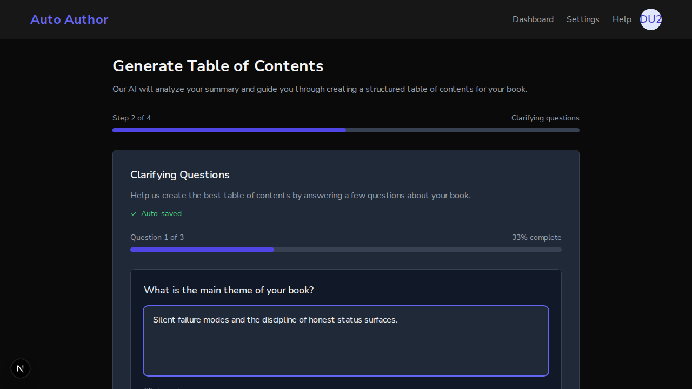
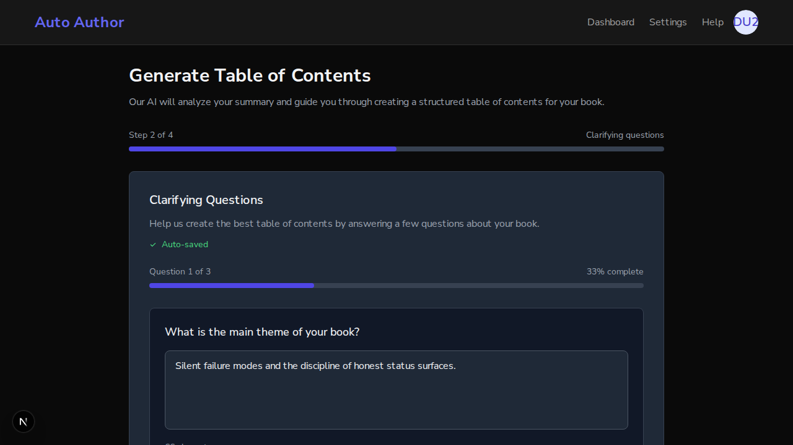
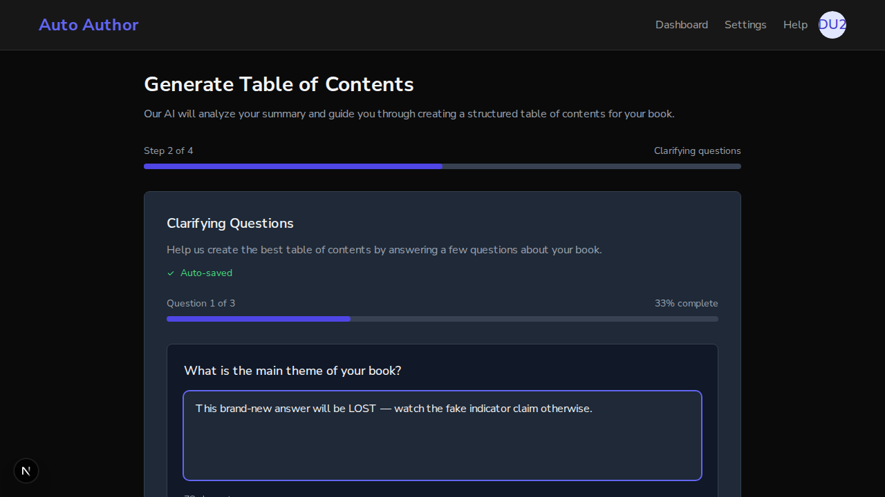
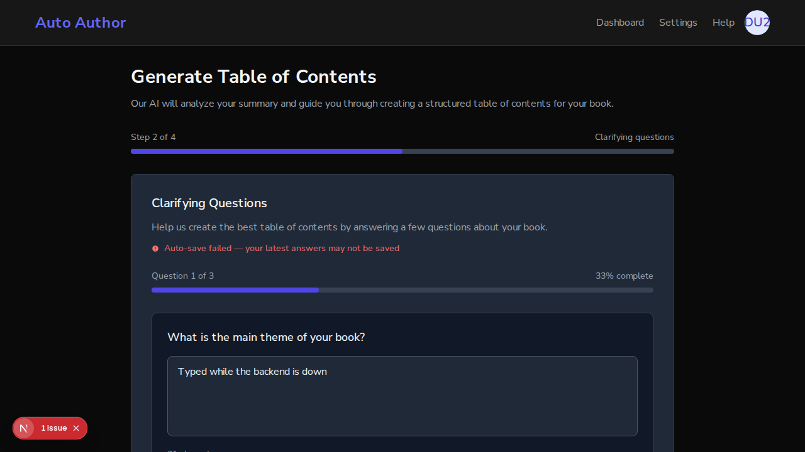

# Issue #203: TOC clarifying-questions auto-save now really persists

*2026-07-12T06:49:40Z*

PR #277 fixes issue #203: the TOC wizard clarifying-questions step showed a green "Auto-saved" indicator without ever calling a persistence API — answers were lost on refresh/navigation while the UI claimed they were saved. This demo runs the REAL stack: one uvicorn backend on :8000 against a REAL local MongoDB with the genuine openai SDK pointed at a local wire stub via OPENAI_BASE_URL (local key is stale; the stub serves deterministic numbered questions), the BRANCH frontend (feature/issue-203-toc-autosave-persist) on :3000, and a PRISTINE origin/main worktree frontend on :3001. Same backend, same database, same real better-auth session — the only variable is the frontend code. BYPASS_AUTH=false everywhere: a real browser signup drives the flow.

Stack up: backend healthy on :8000 (real Mongo, SDK pointed at the stub), branch frontend :3000, pristine-main frontend :3001. A real better-auth signup (demo203@autoauthor.dev) created the book "Persistence Proven" through the UI, the summary was saved, and the TOC wizard generated 3 clarifying questions through the genuine openai SDK against the wire stub. FIRST, THE BRANCH (:3000): type an answer to Q1 and wait past the 2s debounce.

The indicator shows "Auto-saved" — and this time it is TRUE. The same database the backend serves now holds the answer under question_responses, written by PUT /books/{id}/question-responses (the book id is real; the answer text matches what was typed):

```bash {image}
echo docs/demos/issue203-branch-autosaved.png
```



The indicator shows "Auto-saved" — and this time it is TRUE. The database the backend serves now holds the answer under question_responses, written by PUT /books/{id}/question-responses (answer text matches what was typed in the browser):

```bash
mongosh --quiet auto_author --eval 'const b = db.books.findOne({title: "Persistence Proven"}); printjson({responses: b.question_responses.responses, status: b.question_responses.status, answered_at: "MASKED"})'
```

```output
{
  responses: [
    {
      question: 'What is the main theme of your book?',
      answer: 'Silent failure modes and the discipline of honest status surfaces.'
    }
  ],
  status: 'completed',
  answered_at: 'MASKED'
}
```

THE ACCEPTANCE TEST: refresh the page (the exact action that used to destroy all answers). The wizard remounts, regenerates the same deterministic questions, and hydration restores the saved answer from the backend:

```bash
agent-browser get url && agent-browser eval 'document.querySelector("textarea").value'
```

```output
http://localhost:3000/dashboard/books/6a53394a57f5b5dcdfc58d18/generate-toc
"Silent failure modes and the discipline of honest status surfaces."
```

```bash {image}
echo docs/demos/issue203-branch-restored.png
```



The answer SURVIVED the refresh — restored into Q1 (and note the "Next" button is enabled because the restored answer counts). The Auto-saved indicator also reflects the persisted answered_at from the backend. NOW THE CONTROL: the identical flow on the PRISTINE MAIN frontend (:3001) — same backend, same database, same session, same stub.

Main frontend, SAME book, same session. First defect visible immediately: the wizard textarea is EMPTY even though the database holds a saved Q1 answer — main hydrates from a response_text field the backend never returns, so saved answers never pre-fill:

```bash
agent-browser get url && echo "textarea value on load:" && agent-browser eval 'JSON.stringify(document.querySelector("textarea").value)'
```

```output
http://localhost:3001/dashboard/books/6a53394a57f5b5dcdfc58d18/generate-toc
textarea value on load:
"\"\""
```

Now type a NEW answer on main and wait past the debounce — the UI flips to the green "Auto-saved" checkmark:

```bash {image}
echo docs/demos/issue203-main-fake-autosaved.png
```



Main claims "Auto-saved". The database says otherwise — question_responses still holds ONLY the answer the BRANCH saved earlier; the text just typed on main ("This brand-new answer will be LOST...") is nowhere:

```bash
mongosh --quiet auto_author --eval 'const b = db.books.findOne({title: "Persistence Proven"}); printjson({responses: b.question_responses.responses})'
```

```output
{
  responses: [
    {
      question: 'What is the main theme of your book?',
      answer: 'Silent failure modes and the discipline of honest status surfaces.'
    }
  ]
}
```

Refresh main — the moment the issue is about. The just-typed answer is GONE (the textarea is empty again), exactly what a beta user hit after the UI told them their work was saved:

```bash
agent-browser get url && echo "textarea value after refresh on MAIN:" && agent-browser eval 'JSON.stringify(document.querySelector("textarea").value)'
```

```output
http://localhost:3001/dashboard/books/6a53394a57f5b5dcdfc58d18/generate-toc
textarea value after refresh on MAIN:
"\"\""
```

FAILURE PATH (branch): the old code silently claimed success no matter what. The new code must never show "Auto-saved" unless the persist succeeded. Load the branch wizard, then kill the backend and type — the save fails on the wire and the UI says so:

```bash
agent-browser snapshot 2>&1 | grep -iE "auto-save failed" | sed "s/^ *//"
```

```output
- text: Auto-save failed — your latest answers may not be saved
```

```bash {image}
echo docs/demos/issue203-branch-savefailed.png
```



A visible red alert instead of a green lie. Restart the backend and type again — the next debounced save succeeds and the indicator recovers to a truthful Auto-saved:

```bash
agent-browser snapshot 2>&1 | grep -iE "auto-saved" | sed "s/^ *//" | head -1 && mongosh --quiet auto_author --eval 'const b = db.books.findOne({title: "Persistence Proven"}); print("DB now holds: " + JSON.stringify(b.question_responses.responses[0].answer))'
```

```output
- text: Auto-saved Question 1 of 3 33% complete
DB now holds: "Recovered answer, saved for real this time"
```

Wire evidence that the questions came from the genuine openai SDK against the stub (not a test double inside the app) — the stub logged each request; here is one request body showing the SDK kwargs on the wire:

```bash
python3 -c "
import json
line = open(\"/tmp/claude-1000/-home-frankbria-projects-auto-author/95d9d6c2-bd48-42b2-866f-d1b3febe4d3e/scratchpad/stub_requests.log\").readlines()[-1]
d = json.loads(line)
print(\"kwargs on the wire:\", sorted(d.keys()))
print(\"model:\", d[\"model\"], \"| system role:\", d[\"messages\"][0][\"content\"][:60])
"
```

```output
kwargs on the wire: ['max_tokens', 'messages', 'model', 'temperature']
model: gpt-4 | system role: You are an expert book editor. Generate insightful clarifyin
```

SUMMARY — every acceptance criterion demonstrated with outcome evidence: (1) the debounced effect is wired to the real PUT /books/{id}/question-responses (Mongo doc written with the typed text; answer survives a full page refresh on the branch, while the identical flow on pristine main shows the fabricated Auto-saved, writes nothing, and loses the answer on refresh); (2) the indicator only shows after a real successful persist — killing the backend produced a visible red "Auto-save failed" alert instead of the green checkmark, and recovery after restart saved for real. The unit suite pins the same contract: the indicator is gated on a held save promise, the failure path, stale in-flight saves after edits, sparse-list hydration, and deletion persistence (33 tests; 5 of them fail against the old code, which is the mutation evidence for this fix). Frontend: 115 suites, 2093 passed / 8 skipped, coverage gates green.

VERIFICATION NOTE: this demo is a sequence of one-way interactive state transitions (browser typing, a deliberate backend kill/restart, DB values that evolve with each save). Re-running `showboat verify` after the fact replays exec blocks against the FINAL state with the browser closed, so the earlier browser-bound and mid-narrative Mongo blocks intentionally diff (same class as the 2026-07-10 #189 demo) — the final block (DB holds the recovered answer, byte-identical) re-verifies green. The commands and outputs above were captured live by showboat at execution time.
