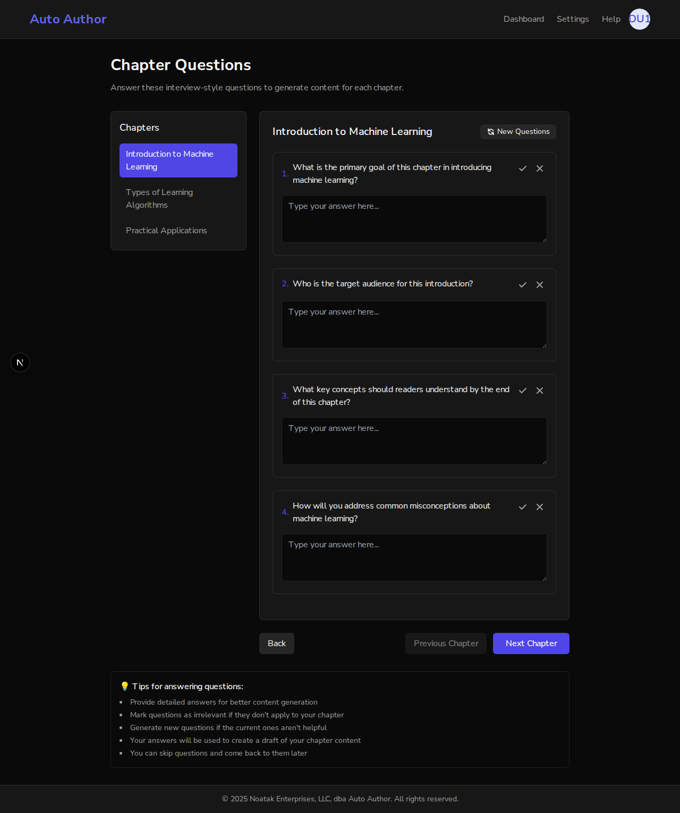
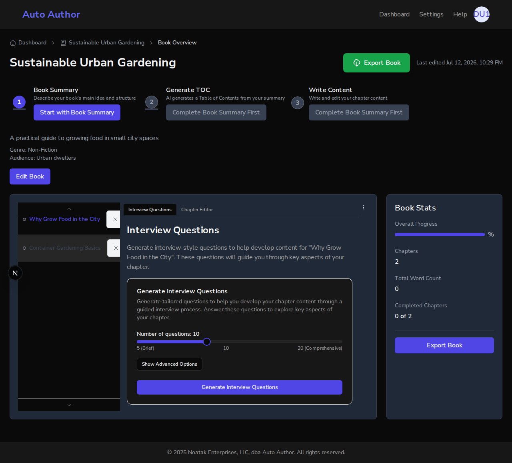

# Issue #193: remove the mock /chapters route serving fabricated questions

*2026-07-12T22:28:33Z*

Setup: real FastAPI backend on :8000 (real local MongoDB), the PR #278 branch frontend on :3000, and a pristine main-worktree frontend on :3001. Auth is real better-auth (no bypass); localhost cookies are shared across ports, so one signup serves both frontends. We sign up a fresh user in a real browser, then create a real book about urban gardening with two chapters via the API.

The real book: "Sustainable Urban Gardening" (id 6a54153095df244a31aaa915) with two real chapters, created through the API by the signed-in user.

```bash
curl -s "http://localhost:8000/api/v1/books/6a54153095df244a31aaa915/chapters" -H "Cookie: $(cat /tmp/claude-1000/-home-frankbria-projects-auto-author/366f3741-d53e-4c12-bea7-3ff2f694afba/scratchpad/cookie.txt)" | jq -r ".. | objects | select(.title? and .id?) | .title"
```

```output
Why Grow Food in the City
Container Gardening Basics
```

**THE BUG (main, :3001)**: navigating to /dashboard/books/<bookId>/chapters — a URL any user can reach — serves a fully fabricated "Chapter Prompts" page: hardcoded Machine Learning interview questions that have nothing to do with this gardening book. The bookId is ignored; every book shows the same fake content, and "regeneration" is a setTimeout.

```bash {image}
agent-browser screenshot --full /home/frankbria/projects/auto-author/docs/demos/issue193-main-fake-questions.png >/dev/null && echo issue193-main-fake-questions.png
```



Main serves HTTP 200 with fabricated "Machine Learning" chapters and questions for the urban-gardening book — convincing fake content, nothing persisted, bookId ignored. The same URL with the same session on the PR branch (:3000):

```bash {image}
agent-browser screenshot /home/frankbria/projects/auto-author/docs/demos/issue193-branch-404.png >/dev/null && echo issue193-branch-404.png
```


The branch returns a genuine 404 — the route no longer exists. Same-session HTTP status differential, same URL on both servers:

```bash
COOKIE=$(cat /tmp/claude-1000/-home-frankbria-projects-auto-author/366f3741-d53e-4c12-bea7-3ff2f694afba/scratchpad/cookie.txt); curl -s -o /dev/null -w "branch :3000 (PR #278) -> %{http_code}\n" -H "Cookie: $COOKIE" "http://localhost:3000/dashboard/books/6a54153095df244a31aaa915/chapters"; curl -s -o /dev/null -w "main   :3001          -> %{http_code}\n" -H "Cookie: $COOKIE" "http://localhost:3001/dashboard/books/6a54153095df244a31aaa915/chapters"
```

```output
branch :3000 (PR #278) -> 404
main   :3001          -> 200
```

**The real Q&A flow is intact on the branch**: the tabbed book page at /dashboard/books/<bookId> lists the real chapters; opening one shows the ChapterEditor with its "Interview Questions" tab (QuestionContainer, wired to real API persistence).

```bash {image}
agent-browser screenshot --full /home/frankbria/projects/auto-author/docs/demos/issue193-branch-real-questions-tab.png >/dev/null && echo issue193-branch-real-questions-tab.png
```



On the branch, the real chapter "Why Grow Food in the City" is open with the **Interview Questions** tab selected — the genuine QuestionContainer (question-count slider + "Generate Interview Questions" wired to the real AI endpoint), for the actual book, replacing nothing: this flow shipped long before this fix and is untouched by it. AC check: (1) the abandoned mock page is deleted and its route 404s; (2) the real Q&A flow is unaffected.
