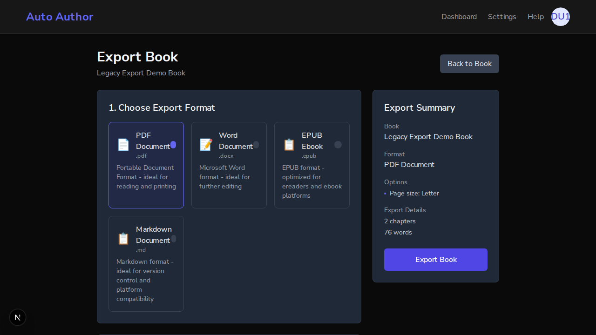
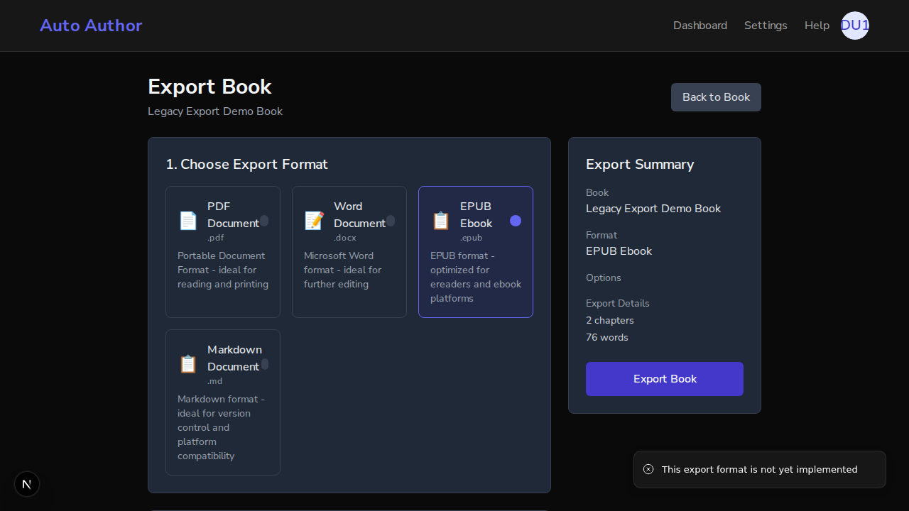
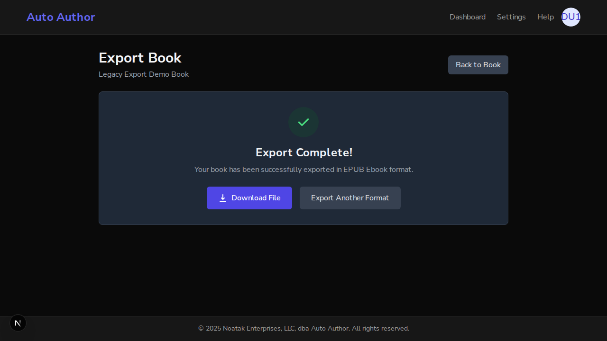
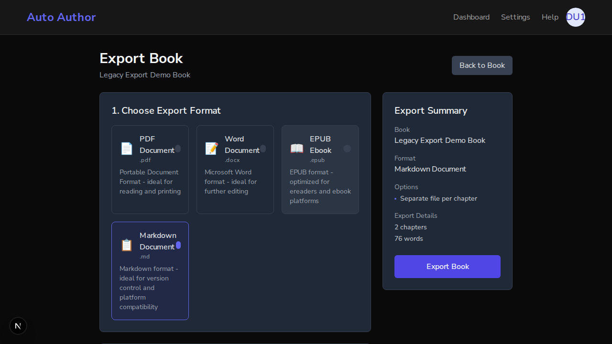

# Issue #194: legacy export page EPUB/Markdown — wired for real (PR #279)

*2026-07-12T23:24:02Z*

Setup: one real FastAPI backend (port 8000, real local MongoDB, BYPASS_AUTH=false), two Next.js dev servers sharing that backend — the fix branch on :3000 and a pristine main worktree on :3001. A real better-auth user (demo194@example.com) was created through the sign-up UI, and a book with two content-bearing chapters was seeded through the authenticated API. Both frontends validate the same session against the same Mongo.

```bash
echo "branch (:3000):" && git log --oneline -1 && echo "main worktree (:3001):" && git -C /tmp/claude-1000/-home-frankbria-projects-auto-author/ffdd9c4f-dee3-49bd-9662-ed6713e6f8e5/scratchpad/main-worktree log --oneline -1
```

```output
branch (:3000):
0f3f356 test(export): pin that multiFile does not leak into EPUB exports (#194)
main worktree (:3001):
7f67df4 [P2.1] fix: remove mock /chapters route serving fabricated questions (#193) (#278)
```

```bash
BOOK_ID=$(cat /tmp/claude-1000/-home-frankbria-projects-auto-author/ffdd9c4f-dee3-49bd-9662-ed6713e6f8e5/scratchpad/book_id.txt); COOKIE=$(cat /tmp/claude-1000/-home-frankbria-projects-auto-author/ffdd9c4f-dee3-49bd-9662-ed6713e6f8e5/scratchpad/cookie.txt); curl -s "http://127.0.0.1:8000/api/v1/books/$BOOK_ID/chapters/metadata" -H "Cookie: $COOKIE" | python3 -c "import json,sys; d=json.load(sys.stdin); [print(c[\"title\"], \"-\", c[\"word_count\"], \"words\") for c in d[\"chapters\"]]"
```

```output
Chapter 1: Demo Content - 38 words
Chapter 2: Demo Content - 38 words
```

THE BUG (main, :3001): the legacy export page advertises all four formats from GET /export/formats, but selecting EPUB and clicking Export Book only produces an error toast — "This export format is not yet implemented".

```bash {image}
agent-browser screenshot /home/frankbria/projects/auto-author/docs/demos/issue194-main-formats.png >/dev/null && echo /home/frankbria/projects/auto-author/docs/demos/issue194-main-formats.png
```



```bash {image}
echo /home/frankbria/projects/auto-author/docs/demos/issue194-main-epub-toast.png
```



```bash
agent-browser eval "window.__toastSeen"
```

```output
"This export format is not yet implemented"
```

The toast text was captured live by a MutationObserver armed before the click. Markdown hits the identical dead end on main — same toast, verified below. Note also that on main the Options panel is empty for EPUB/Markdown and both formats share the generic clipboard icon.

```bash
agent-browser eval "window.__toastSeen || document.querySelector(\"[data-sonner-toast]\")?.textContent"
```

```output
"This export format is not yet implemented"
```

THE FIX (branch, :3000): same book, same session, same backend. Selecting EPUB and exporting now completes and offers a download. The Markdown card additionally exposes a "Separate File Per Chapter" toggle.

```bash {image}
echo /home/frankbria/projects/auto-author/docs/demos/issue194-branch-epub-complete.png
```



```bash
agent-browser eval "window.__downloadName"
```

```output
"legacy_export_demo_book.epub"
```

The EPUB export completed and the browser download was named with the correct extension (captured by wrapping the anchor click). Now Markdown with the new "Separate File Per Chapter" toggle — the plan said to leave the download logic alone, but exploration showed multi-file Markdown returns a ZIP archive while the advertised extension is .md; the fix names that download .zip.

```bash {image}
echo /home/frankbria/projects/auto-author/docs/demos/issue194-branch-md-options.png
```



```bash
agent-browser eval "window.__downloadName"
```

```output
"legacy_export_demo_book.zip"
```

Byte-level proof the downloads are real files: the same three endpoints the page calls, hit with the same authenticated session. EPUB carries the EPUB magic, single-file Markdown is the actual book text, and multi-file Markdown is a genuine ZIP with one .md per chapter.

```bash
SP=/tmp/claude-1000/-home-frankbria-projects-auto-author/ffdd9c4f-dee3-49bd-9662-ed6713e6f8e5/scratchpad; COOKIE=$(cat $SP/cookie.txt); BOOK_ID=$(cat $SP/book_id.txt); curl -s "http://127.0.0.1:8000/api/v1/books/$BOOK_ID/export/epub" -H "Cookie: $COOKIE" -o $SP/demo.epub && file $SP/demo.epub
```

```output
/tmp/claude-1000/-home-frankbria-projects-auto-author/ffdd9c4f-dee3-49bd-9662-ed6713e6f8e5/scratchpad/demo.epub: EPUB document
```

```bash
SP=/tmp/claude-1000/-home-frankbria-projects-auto-author/ffdd9c4f-dee3-49bd-9662-ed6713e6f8e5/scratchpad; COOKIE=$(cat $SP/cookie.txt); BOOK_ID=$(cat $SP/book_id.txt); curl -s "http://127.0.0.1:8000/api/v1/books/$BOOK_ID/export/markdown" -H "Cookie: $COOKIE" | head -8
```

```output
# Legacy Export Demo Book

by Demo User 194

Genre: non-fiction • Target Audience: general

Demo for issue 194

```

```bash
SP=/tmp/claude-1000/-home-frankbria-projects-auto-author/ffdd9c4f-dee3-49bd-9662-ed6713e6f8e5/scratchpad; COOKIE=$(cat $SP/cookie.txt); BOOK_ID=$(cat $SP/book_id.txt); curl -s "http://127.0.0.1:8000/api/v1/books/$BOOK_ID/export/markdown?multi_file=true" -H "Cookie: $COOKIE" -o $SP/demo-chapters.zip && file $SP/demo-chapters.zip && unzip -l $SP/demo-chapters.zip
```

```output
/tmp/claude-1000/-home-frankbria-projects-auto-author/ffdd9c4f-dee3-49bd-9662-ed6713e6f8e5/scratchpad/demo-chapters.zip: Zip archive data, at least v2.0 to extract, compression method=deflate
Archive:  /tmp/claude-1000/-home-frankbria-projects-auto-author/ffdd9c4f-dee3-49bd-9662-ed6713e6f8e5/scratchpad/demo-chapters.zip
  Length      Date    Time    Name
---------  ---------- -----   ----
      287  2026-07-12 16:27   01-chapter-1-demo-content.md
      287  2026-07-12 16:27   02-chapter-2-demo-content.md
---------                     -------
      574                     2 files
```

Regression check: the two formats that already worked are untouched — same endpoints, same bytes.

```bash
SP=/tmp/claude-1000/-home-frankbria-projects-auto-author/ffdd9c4f-dee3-49bd-9662-ed6713e6f8e5/scratchpad; COOKIE=$(cat $SP/cookie.txt); BOOK_ID=$(cat $SP/book_id.txt); curl -s "http://127.0.0.1:8000/api/v1/books/$BOOK_ID/export/pdf" -H "Cookie: $COOKIE" -o $SP/demo.pdf && file $SP/demo.pdf && curl -s "http://127.0.0.1:8000/api/v1/books/$BOOK_ID/export/docx" -H "Cookie: $COOKIE" -o $SP/demo.docx && file $SP/demo.docx
```

```output
/tmp/claude-1000/-home-frankbria-projects-auto-author/ffdd9c4f-dee3-49bd-9662-ed6713e6f8e5/scratchpad/demo.pdf: PDF document, version 1.4, 4 page(s)
/tmp/claude-1000/-home-frankbria-projects-auto-author/ffdd9c4f-dee3-49bd-9662-ed6713e6f8e5/scratchpad/demo.docx: Microsoft Word 2007+
```

Summary: on main, EPUB and Markdown were selectable but dead-ended in "This export format is not yet implemented". On the branch the same book, session, and backend produce a real EPUB (magic-byte verified), a real single-file Markdown export, and a multi-file Markdown ZIP with one file per chapter — and the browser download for the multi-file case is correctly named .zip rather than .md. PDF and DOCX behavior is unchanged.

Reproducibility note: `showboat verify` re-runs green for all curl/file blocks after resetting the per-user export rate limiter (10/hour — flush the `:rl:` keys in usage_counters between runs, the #244 gotcha). Expected intentional diffs: the four agent-browser eval blocks read live browser session state (window.__toastSeen / window.__downloadName) that only exists mid-narrative, and the multi-file ZIP listing differs only in entry timestamps (the archive is stamped at export time). Same classes as the #189/#203 demos.
