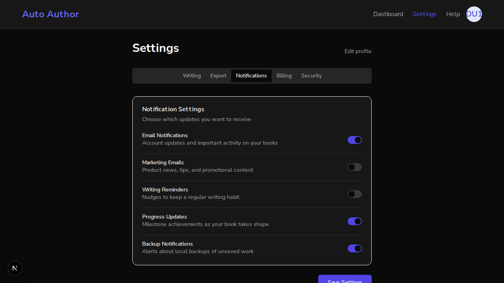
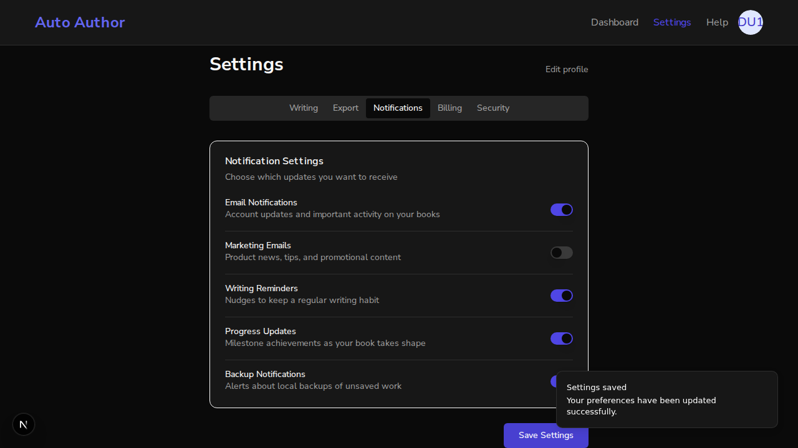
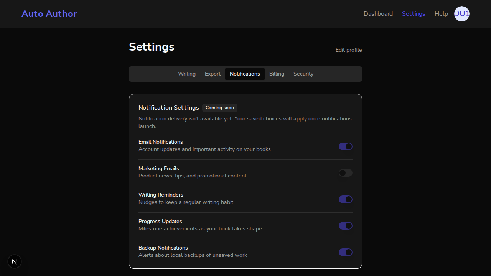

# Issue #195: Notification toggles gated as "Coming soon" (PR #281)

*2026-07-13T00:36:58Z*

The Notifications settings tab rendered five interactive toggles promising concrete outcomes ("Writing Reminders: Nudges to keep a regular writing habit", "Progress Updates: Milestone achievements", ...). The flags persist to UserPreferences, but the backend has no notification-delivery code — nothing reads them. Beta users were promised alerts that never arrive.

Setup: one real backend (uvicorn :8000) + real local MongoDB + a genuine better-auth signup. Branch `fix/195-gate-notification-toggles` frontend on :3000 vs a pristine `main` worktree frontend on :3001, sharing the same session and stored preferences.

BEFORE (main, :3001): the Notifications tab renders five fully interactive switches. Nothing marks them as undeliverable.

```bash {image}
echo docs/demos/issue195-main-interactive.png
```



On main the user can flip "Writing Reminders" and hit Save — the UI confirms "Settings saved". The user now believes they will get writing-habit nudges.

```bash {image}
echo docs/demos/issue195-main-toggled-saved.png
```



```bash
mongosh --quiet auto_author --eval 'const u = db.users.findOne({email:"demo195@example.com"}, {preferences:1,_id:0}); print("writing_reminders persisted as: " + u.preferences.writing_reminders)'
```

```output
writing_reminders persisted as: true
```

But the promise is empty: nothing in the backend ever reads these flags. The only occurrences of writing_reminders in the entire backend are the schema/model definitions and their tests — there is no SMTP, scheduler, or delivery code.

```bash
grep -rn "writing_reminders" backend/app/ --include="*.py"; echo "--- delivery infrastructure hits:"; grep -rniE "smtp|sendgrid|send_email|notification_service" backend/app/ --include="*.py" | wc -l
```

```output
backend/app/models/user.py:38:    writing_reminders: bool = False
backend/app/schemas/user.py:22:    writing_reminders: bool = False
--- delivery infrastructure hits:
0
```

AFTER (branch, :3000): the same user, same stored preferences. The Notifications tab now shows a "Coming soon" badge, honest copy ("Notification delivery is not available yet"), and every switch disabled. The stored writing_reminders=true still renders — the contract is preserved, not cleared.

```bash {image}
agent-browser screenshot docs/demos/issue195-branch-gated.png >/dev/null && echo docs/demos/issue195-branch-gated.png
```



```bash
agent-browser snapshot -i 2>/dev/null | grep -E 'switch' | sed 's/ \[ref=e[0-9]*\]//'
```

```output
- switch "Email Notifications" [checked] [disabled]
- switch "Marketing Emails" [disabled]
- switch "Writing Reminders" [checked] [disabled]
- switch "Progress Updates" [checked] [disabled]
- switch "Backup Notifications" [checked] [disabled]
```

Clicking a disabled switch does nothing — the checked state cannot change from this UI.

```bash
agent-browser eval 'const el = document.getElementById("notification-marketing_emails"); el.click(); el.getAttribute("data-state") + " / disabled=" + el.disabled'
```

```output
"unchecked / disabled=true"
```

Round-trip preservation: on the branch, an unrelated preference (Default Writing Style -> technical) was edited via the UI and saved. The gated notification flags survive the merged PATCH unchanged.

```bash
mongosh --quiet auto_author --eval 'const u = db.users.findOne({email:"demo195@example.com"}, {preferences:1,_id:0}); const p = u.preferences; print("default_writing_style: " + p.default_writing_style + "  (edited on the branch just now)"); print("writing_reminders: " + p.writing_reminders + "  (unchanged from the main-side save)"); print("marketing_emails: " + p.marketing_emails + "  (unchanged)"); print("email_notifications: " + p.email_notifications + "  (unchanged)")'
```

```output
default_writing_style: technical  (edited on the branch just now)
writing_reminders: true  (unchanged from the main-side save)
marketing_emails: false  (unchanged)
email_notifications: true  (unchanged)
```

Acceptance criterion met: the undeliverable toggles are gated behind a disabled "Coming soon" state — beta users are no longer promised alerts that never arrive — while stored preference values render and round-trip untouched, ready for when notification delivery ships.
