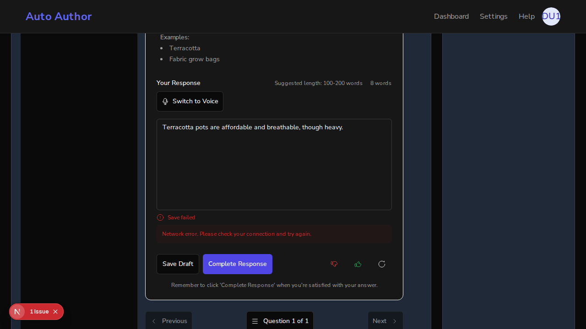
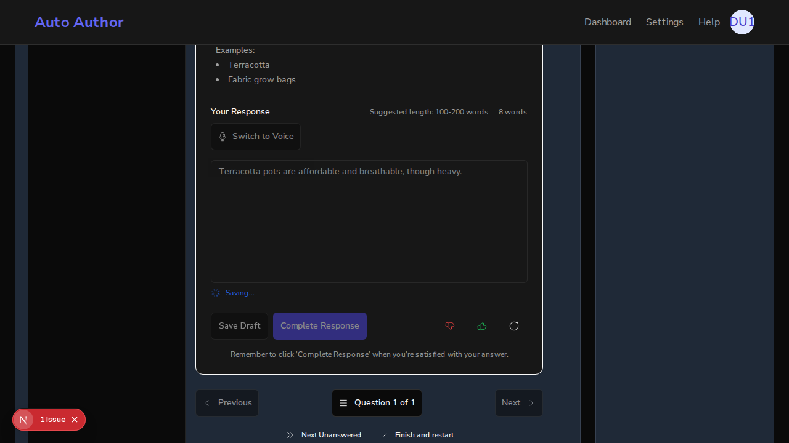
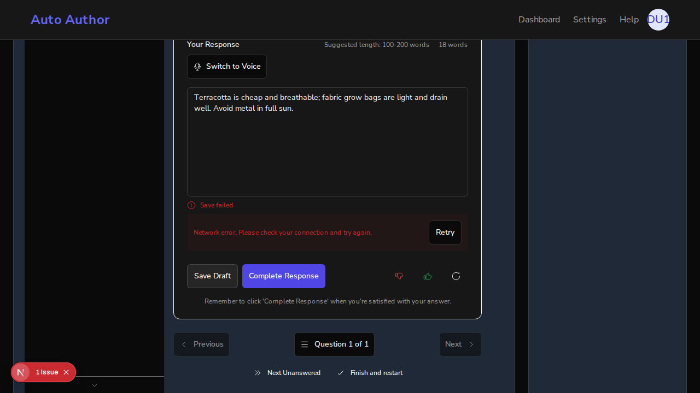

# Issue #197: failed-save errors persist — auto-save no longer wipes them

*2026-07-13T03:11:30Z*

Setup: real uvicorn backend on :8000 against a real local MongoDB, a genuine better-auth signup (demo197@example.com) in a real browser, one book + chapter created through the live API with the session cookie, and one seeded interview question. Two frontends serve the differential: the fix branch on :3000 and a pristine main worktree on :3001, same user session and the same book. First, the servers and the seeded question as the API serves it.

```bash
curl -s http://localhost:8000/api/v1/health; echo; curl -s -o /dev/null -w "branch frontend :3000 -> HTTP %{http_code}\n" http://localhost:3000; curl -s -o /dev/null -w "main frontend   :3001 -> HTTP %{http_code}\n" http://localhost:3001; COOKIE=$(cat /tmp/claude-1000/-home-frankbria-projects-auto-author/e877ebe8-bbb3-4651-bfae-14e70190d18b/scratchpad/demo197/cookie.txt); curl -s "http://localhost:8000/api/v1/books/6a54572c88d86ee551cef48f/chapters/433300dd-1d0a-4363-9ffe-c7ec383ba672/questions" -H "Cookie: $COOKIE" | python3 -c "import json,sys; q=json.load(sys.stdin)[\"questions\"][0]; print(\"question:\", q[\"question_text\"])"
```

```output
{"status":"healthy"}
branch frontend :3000 -> HTTP 200
main frontend   :3001 -> HTTP 200
question: What container materials work best for beginners, and why?
```

THE BUG (main, :3001): the user answered the seeded interview question, the backend was killed to make saves fail, and one save was triggered. On main the 3-second auto-save effect re-fires after every failure — each cycle wipes the freshly-shown error banner back to "Saving...", and the component hammers the dead endpoint forever. A fetch counter installed on window.fetch counts requests to the save endpoint; two samples 8 seconds apart show the count climbing and the status flapping between the error and its erasure.

```bash
agent-browser eval "JSON.stringify({saveEndpointCalls: window.__saveCalls, statusNow: (document.body.innerText.match(/Saving\\.\\.\\.|Save failed|Saved successfully/)||[\"none\"])[0]})"; sleep 8; agent-browser eval "JSON.stringify({saveEndpointCalls: window.__saveCalls, statusNow: (document.body.innerText.match(/Saving\\.\\.\\.|Save failed|Saved successfully/)||[\"none\"])[0]})"
```

```output
"{\"saveEndpointCalls\":21,\"statusNow\":\"Saving...\"}"
"{\"saveEndpointCalls\":23,\"statusNow\":\"Saving...\"}"
```

Polling once per second: the error banner appears when a retry cycle exhausts, then auto-save re-arms and wipes it back to "Saving..." — the user never gets a stable error to act on.

```bash
for i in $(seq 1 14); do agent-browser eval "JSON.stringify({t:$i, calls: window.__saveCalls, status: (document.body.innerText.match(/Saving\\.\\.\\.|Save failed/)||[\"-\"])[0], banner: !!document.body.innerText.match(/check your connection/i)})"; sleep 1; done
```

```output
"{\"t\":1,\"calls\":26,\"status\":\"Saving...\",\"banner\":false}"
"{\"t\":2,\"calls\":27,\"status\":\"Saving...\",\"banner\":false}"
"{\"t\":3,\"calls\":27,\"status\":\"Saving...\",\"banner\":false}"
"{\"t\":4,\"calls\":27,\"status\":\"Saving...\",\"banner\":false}"
"{\"t\":5,\"calls\":27,\"status\":\"Saving...\",\"banner\":false}"
"{\"t\":6,\"calls\":27,\"status\":\"Save failed\",\"banner\":true}"
"{\"t\":7,\"calls\":27,\"status\":\"Save failed\",\"banner\":true}"
"{\"t\":8,\"calls\":27,\"status\":\"Save failed\",\"banner\":true}"
"{\"t\":9,\"calls\":28,\"status\":\"Saving...\",\"banner\":false}"
"{\"t\":10,\"calls\":29,\"status\":\"Saving...\",\"banner\":false}"
"{\"t\":11,\"calls\":29,\"status\":\"Saving...\",\"banner\":false}"
"{\"t\":12,\"calls\":30,\"status\":\"Saving...\",\"banner\":false}"
"{\"t\":13,\"calls\":30,\"status\":\"Saving...\",\"banner\":false}"
"{\"t\":14,\"calls\":30,\"status\":\"Saving...\",\"banner\":false}"
```

```bash {image}
/tmp/claude-1000/-home-frankbria-projects-auto-author/e877ebe8-bbb3-4651-bfae-14e70190d18b/scratchpad/demo197/shot-when.sh true 197-main-error-shown.png
```



The error banner (with its Retry button) is on screen. Seconds later, the re-armed auto-save wipes it back to "Saving..." — same page, no user action in between:

```bash {image}
/tmp/claude-1000/-home-frankbria-projects-auto-author/e877ebe8-bbb3-4651-bfae-14e70190d18b/scratchpad/demo197/shot-when.sh false 197-main-error-wiped.png
```



THE FIX (branch, :3000): same user, same book, same question. (The textarea hydrates the draft that main's runaway loop eventually persisted once the backend came back — itself evidence of the uncontrolled retries.) First, the healthy path: a fresh edit auto-saves green with the backend up.

```bash
agent-browser eval "const ta = document.getElementById(\"response\"); const set = Object.getOwnPropertyDescriptor(window.HTMLTextAreaElement.prototype, \"value\").set; set.call(ta, \"Terracotta is cheap and breathable; fabric grow bags are light and drain well.\"); ta.dispatchEvent(new Event(\"input\", {bubbles: true})); \"typed\""; sleep 6; agent-browser eval "JSON.stringify({saveEndpointCalls: window.__saveCalls, status: (document.body.innerText.match(/Saving\\.\\.\\.|Save failed|Saved successfully/)||[\"idle\"])[0]})"
```

```output
"typed"
"{\"saveEndpointCalls\":12,\"status\":\"Saved successfully\"}"
```

Kill the backend and make a manual save fail. The counter is reset to 0 at the moment of the click; ErrorHandler makes its 3 internal attempts (~7s of backoff), then the error surfaces. On the fix branch it must then go quiet: the count stays frozen and the banner stays up — no 3-second auto-save wipe.

```bash
pkill -f '[u]vicorn app.main'; sleep 1; curl -s -m 2 http://localhost:8000/api/v1/health || echo 'backend DOWN'
```

```output
backend DOWN
```

```bash
agent-browser eval "const ta = document.getElementById(\"response\"); const set = Object.getOwnPropertyDescriptor(window.HTMLTextAreaElement.prototype, \"value\").set; set.call(ta, \"Terracotta is cheap and breathable; fabric grow bags are light and drain well. Avoid metal in full sun.\"); ta.dispatchEvent(new Event(\"input\", {bubbles: true})); window.__saveCalls = 0; \"edited, counter reset\""; agent-browser find role button click --name "Save Draft" >/dev/null 2>&1 || agent-browser eval "[...document.querySelectorAll(\"button\")].find(b=>b.textContent.trim()===\"Save Draft\").click(); \"clicked Save Draft\""; for i in 1 2 3 4 5 6 7 8 9 10 11 12 13 14 15 16 17 18; do agent-browser eval "JSON.stringify({t:$i, calls: window.__saveCalls, status: (document.body.innerText.match(/Saving\\.\\.\\.|Save failed/)||[\"-\"])[0], banner: !!document.body.innerText.match(/check your connection/i)})"; sleep 1; done
```

```output
"edited, counter reset"
"clicked Save Draft"
"{\"t\":1,\"calls\":1,\"status\":\"Saving...\",\"banner\":false}"
"{\"t\":2,\"calls\":2,\"status\":\"Saving...\",\"banner\":false}"
"{\"t\":3,\"calls\":2,\"status\":\"Saving...\",\"banner\":false}"
"{\"t\":4,\"calls\":3,\"status\":\"Saving...\",\"banner\":false}"
"{\"t\":5,\"calls\":3,\"status\":\"Saving...\",\"banner\":false}"
"{\"t\":6,\"calls\":3,\"status\":\"Saving...\",\"banner\":false}"
"{\"t\":7,\"calls\":3,\"status\":\"Saving...\",\"banner\":false}"
"{\"t\":8,\"calls\":3,\"status\":\"Save failed\",\"banner\":true}"
"{\"t\":9,\"calls\":3,\"status\":\"Save failed\",\"banner\":true}"
"{\"t\":10,\"calls\":3,\"status\":\"Save failed\",\"banner\":true}"
"{\"t\":11,\"calls\":3,\"status\":\"Save failed\",\"banner\":true}"
"{\"t\":12,\"calls\":3,\"status\":\"Save failed\",\"banner\":true}"
"{\"t\":13,\"calls\":3,\"status\":\"Save failed\",\"banner\":true}"
"{\"t\":14,\"calls\":3,\"status\":\"Save failed\",\"banner\":true}"
"{\"t\":15,\"calls\":3,\"status\":\"Save failed\",\"banner\":true}"
"{\"t\":16,\"calls\":3,\"status\":\"Save failed\",\"banner\":true}"
"{\"t\":17,\"calls\":3,\"status\":\"Save failed\",\"banner\":true}"
"{\"t\":18,\"calls\":3,\"status\":\"Save failed\",\"banner\":true}"
```

The error banner persists — 11+ consecutive seconds, save calls frozen at the 3 internal attempts, Retry button available. Compare with main, where the same state was wiped after 3 seconds:

```bash {image}
echo 197-branch-error-persists.png
```



Recovery: restart the backend, then simply keep typing. The edit is "the user acting" — the banner clears immediately (captured before any new request completes), auto-save re-arms for the new input, and the answer lands in MongoDB.

```bash
agent-browser eval "const ta = document.getElementById(\"response\"); const set = Object.getOwnPropertyDescriptor(window.HTMLTextAreaElement.prototype, \"value\").set; set.call(ta, \"Terracotta is cheap and breathable; fabric grow bags are light and drain well. Avoid metal in full sun. Ensure every pot has drainage holes.\"); ta.dispatchEvent(new Event(\"input\", {bubbles: true})); JSON.stringify({rightAfterEdit: {bannerGone: !document.body.innerText.match(/check your connection/i), saveFailedGone: !document.body.innerText.match(/Save failed/)}})"; sleep 6; agent-browser eval "JSON.stringify({sixSecondsLater: {status: (document.body.innerText.match(/Saving\\.\\.\\.|Save failed|Saved successfully/)||[\"idle\"])[0]}})"
```

```output
"{\"rightAfterEdit\":{\"bannerGone\":true,\"saveFailedGone\":true}}"
"{\"sixSecondsLater\":{\"status\":\"Saved successfully\"}}"
```

The banner cleared in the same tick as the keystroke, and 6 seconds later the resumed auto-save reported success. The database confirms the final text was persisted:

```bash
mongosh --quiet auto_author --eval "const r = db.question_responses.findOne({question_id: \"6a5457451fcef67a1ae56cef\"}); printjson({response_text: r.response_text, status: r.status, updated_at: r.updated_at})"
```

```output
{
  response_text: 'Terracotta is cheap and breathable; fabric grow bags are light and drain well. Avoid metal in full sun. Ensure every pot has drainage holes.',
  status: 'draft',
  updated_at: ISODate('2026-07-13T03:21:41.666Z')
}
```

Acceptance criterion 2: the three skipped error-path tests are re-enabled. The diff removes exactly three it.skip markers (plus the stale TODOs and debug console.logs), and the suite runs them for real — 16 tests, 0 skipped — alongside four new regression pins (auto-save suppressed after failure; edit clears error and resumes; a stale saved→idle timer cannot clobber an error; retry allowance resets on edit). All pins were RED-verified against the unfixed component.

```bash
cd /home/frankbria/projects/auto-author && git diff main...HEAD -- frontend/src/components/chapters/questions/__tests__/QuestionDisplay.enhanced.test.tsx | grep -E "^[-+].*it(\.skip)?\(" | head -20
```

```output
-    it.skip('should show network error message with actionable suggestion', async () => {
+    it('should show network error message with actionable suggestion', async () => {
-    it.skip('should show server error message', async () => {
+    it('should show server error message', async () => {
+    it('does not auto-save again after a failed save; error persists until the user acts', async () => {
+    it('clears the error when the user edits, and auto-save resumes', async () => {
+    it('does not let a stale saved→idle timer clear a later error state', async () => {
+    it('resets the retry allowance when the user edits after exhausting retries', async () => {
-    it.skip('should handle completion errors with retry', async () => {
+    it('should handle completion errors with retry', async () => {
```

```bash
cd /home/frankbria/projects/auto-author/frontend && npx jest src/components/chapters/questions/__tests__/QuestionDisplay.enhanced.test.tsx --verbose 2>&1 | grep -E "✓|✗|✕|Tests:" | sed "s/([0-9]* ms)//"
```

```output
      ✓ should show saving status indicator 
      ✓ should show saved status after successful save 
      ✓ should show error status with retry button on failure 
      ✓ should retry save operation when retry button is clicked 
      ✓ should queue save when offline 
      ✓ should show offline mode indicator 
      ✓ should show connection restored notification 
      ✓ should show network error message with actionable suggestion 
      ✓ should show authentication error message 
      ✓ should show server error message 
      ✓ does not auto-save again after a failed save; error persists until the user acts 
      ✓ clears the error when the user edits, and auto-save resumes 
      ✓ does not let a stale saved→idle timer clear a later error state 
      ✓ resets the retry allowance when the user edits after exhausting retries 
      ✓ should handle completion errors with retry 
      ✓ should queue completion when offline 
Tests:       16 passed, 16 total
```

Summary. Main: a failed save showed its error for ~3 seconds before the auto-save debounce wiped it and hammered the dead endpoint indefinitely (counter climbed 26→30 in one 14s window, banner true→false with no user action). Branch: the same failure froze at exactly 3 requests (the internal retry budget) with the banner and Retry button stable for 11+ seconds; a keystroke cleared the error in the same tick, auto-save resumed, and the edited answer persisted to MongoDB. The three formerly-skipped error-path tests run green (16/16, 0 skipped) with four new RED-verified regression pins. NB: this demo contains one-way state transitions (backend kill/restart, per-run counters), so showboat verify will intentionally diff on the live-browser blocks.
