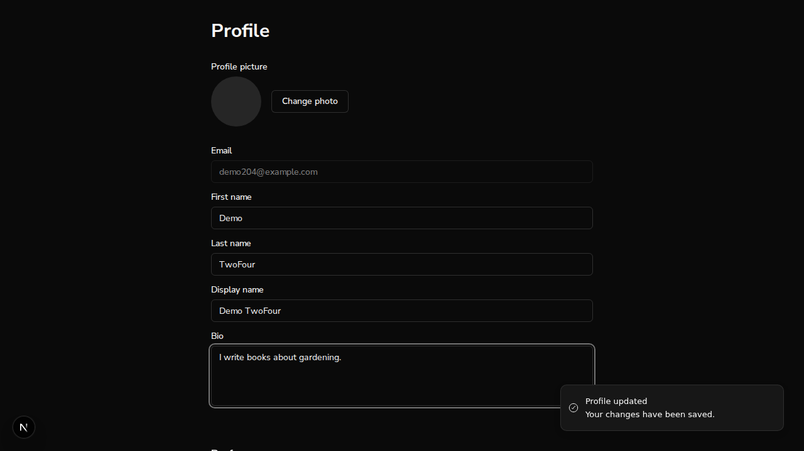
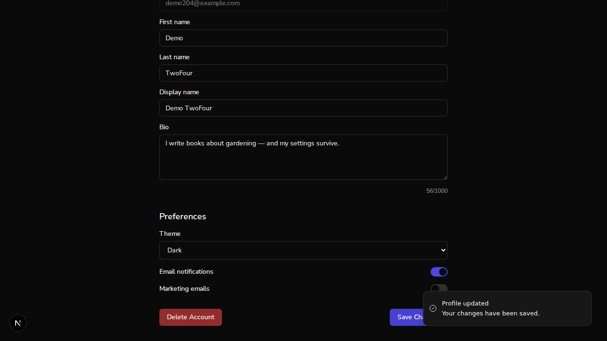
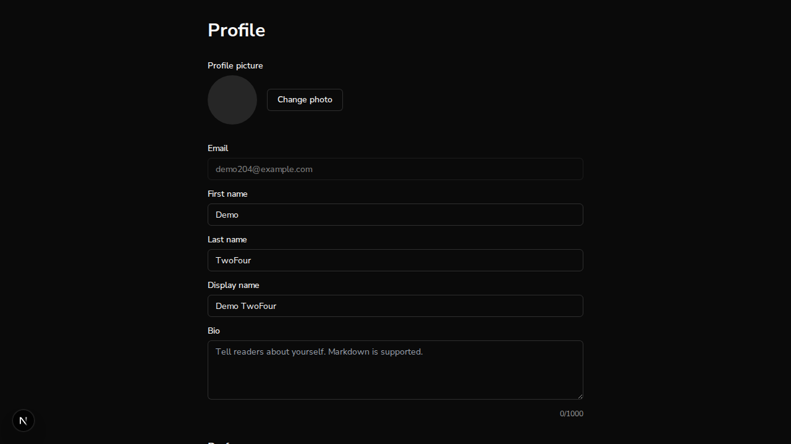

# Issue #204: profile save no longer wipes Settings-page preferences

*2026-07-13T19:29:16Z*

Setup: one real FastAPI backend on :8000 against the real Mongo database, two Next.js dev servers — **main** (pristine worktree) on :3001 and the **fix branch** on :3000 — and a genuine better-auth signup in a real browser. No mocks anywhere. We sign up a fresh user, configure Writing settings on the Settings page, then save an unrelated bio edit on the Profile page — first on main (the bug), then on the branch (the fix) — and read the stored preferences subdocument from Mongo after each save.

A fresh user `demo204@example.com` signed up in the browser on **main** (:3001) and saved Writing settings on the Settings page: Default Writing Style → **academic**, Auto-save Interval → **10s**. The stored preferences subdocument (read straight from Mongo via `scripts/demo204-prefs.sh`, which loads the connection string from `backend/.env`):

```scripts/demo204-prefs.sh

```

```output
MongoServerError: bad auth : authentication failed
```

```scripts/demo204-prefs.sh

```

```output
{
  "preferences": {
    "theme": "dark",
    "email_notifications": true,
    "marketing_emails": false,
    "default_writing_style": "academic",
    "auto_save_interval": 10,
    "default_export_format": "pdf",
    "default_page_size": "letter",
    "include_empty_chapters": false,
    "writing_reminders": false,
    "progress_updates": true,
    "backup_notifications": true
  }
}
```

**The bug (main, :3001)**: on the Profile page the user edits only their bio and clicks Save Changes. The UI cheerfully reports success:

```bash {image}
echo docs/demos/issue204-main-toast.png
```



But the stored preferences subdocument has been silently replaced by the 3-field object the Profile page sent — every Settings-page preference (writing style, auto-save interval, export format, page size, notification flags) is gone:

```scripts/demo204-prefs.sh

```

```output
{
  "preferences": {
    "theme": "dark",
    "email_notifications": true,
    "marketing_emails": false
  },
  "bio": "I write books about gardening."
}
```

Settings were restored on the Settings page (back to 11 stored preference fields, verified before proceeding). **The fix (branch, :3000)**: the same user signs in on the branch frontend, edits only the bio on the Profile page, and saves:

```bash {image}
echo docs/demos/issue204-branch-toast.png
```



This time the stored subdocument keeps every Settings-page field — the page merged the full loaded preferences before the PATCH (the new bio proves this really is the post-save document):

```scripts/demo204-prefs.sh

```

```output
{
  "preferences": {
    "theme": "dark",
    "email_notifications": true,
    "marketing_emails": false,
    "default_writing_style": "academic",
    "auto_save_interval": 10,
    "default_export_format": "pdf",
    "default_page_size": "letter",
    "include_empty_chapters": false,
    "writing_reminders": false,
    "progress_updates": true,
    "backup_notifications": true
  },
  "bio": "I write books about gardening — and my settings survive."
}
```

**The failure-path guard (branch)**: with the backend killed, the Profile page cannot load the current preferences — so instead of letting a save wipe them (a save with nothing loaded would $set-replace the subdocument with just the 3 form fields), the page shows an alert and disables Save Changes:

```bash {image}
echo docs/demos/issue204-branch-load-error.png
```



```bash
agent-browser get text "p[role=alert]"; agent-browser eval "[...document.querySelectorAll(\"button\")].find(b=>b.textContent.includes(\"Save Changes\")).disabled"
```

```output
Couldn't load your current preferences. Saving is disabled to avoid overwriting them.
true
```

Backend restarted. Recap: the same bio-only Profile save that **wiped 8 Settings-page preference fields on main** (11 → 3) **preserves all of them on the branch** (11 → 11, plus the bio change), and a failed preferences load now disables saving instead of silently arming the wipe. Unit pins: `ProfilePageSave.test.tsx` (5 tests — merge contract, cache invalidation, load-failure guard, dirty-path hydration via keepDirtyValues, user-switch re-arm), all mutation-verified RED. Frontend suite: 117 suites, 2123 passed / 5 skipped. NB this demo contains one-way state transitions (the Mongo document changes mid-narrative and the guard block needs a dead backend), so `showboat verify` intentionally diffs on those blocks — the #203/#189 precedent.
