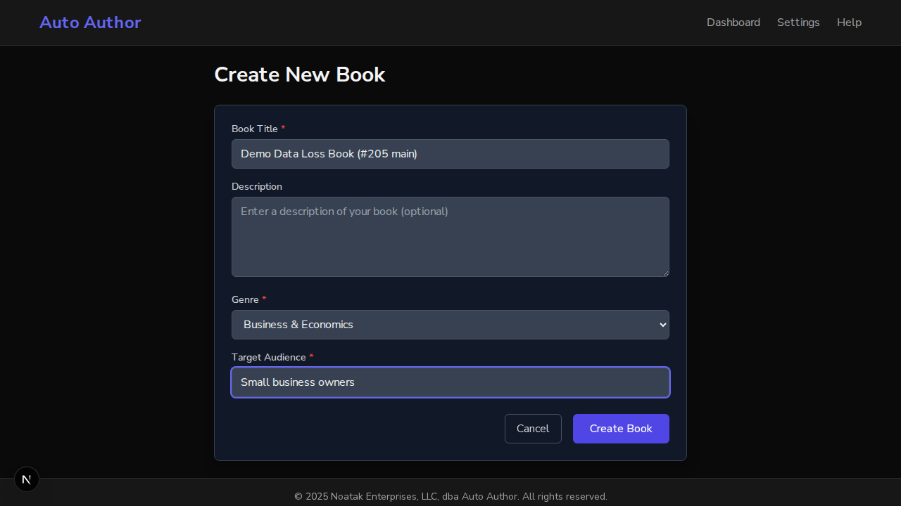
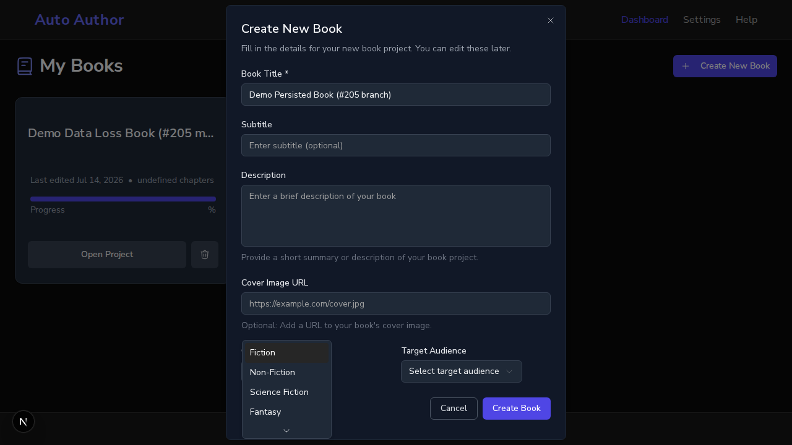
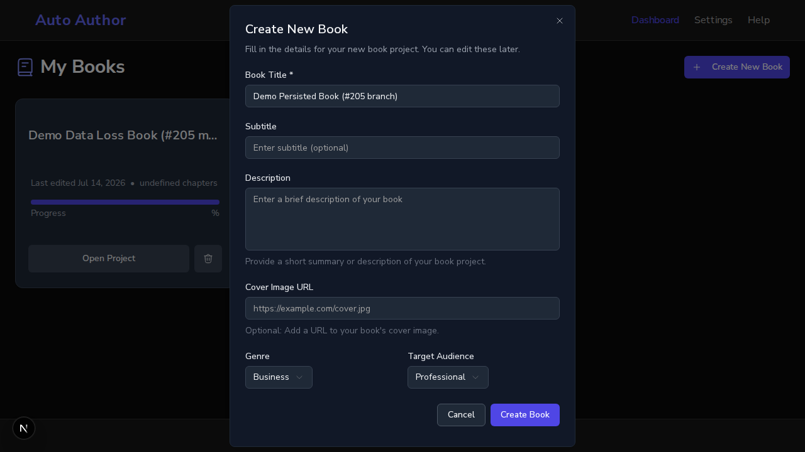
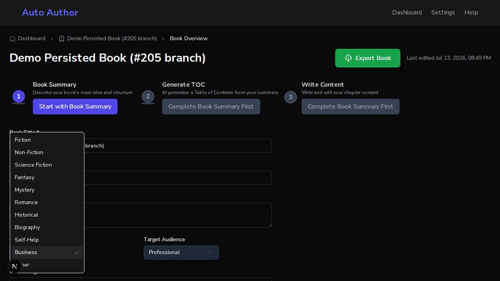
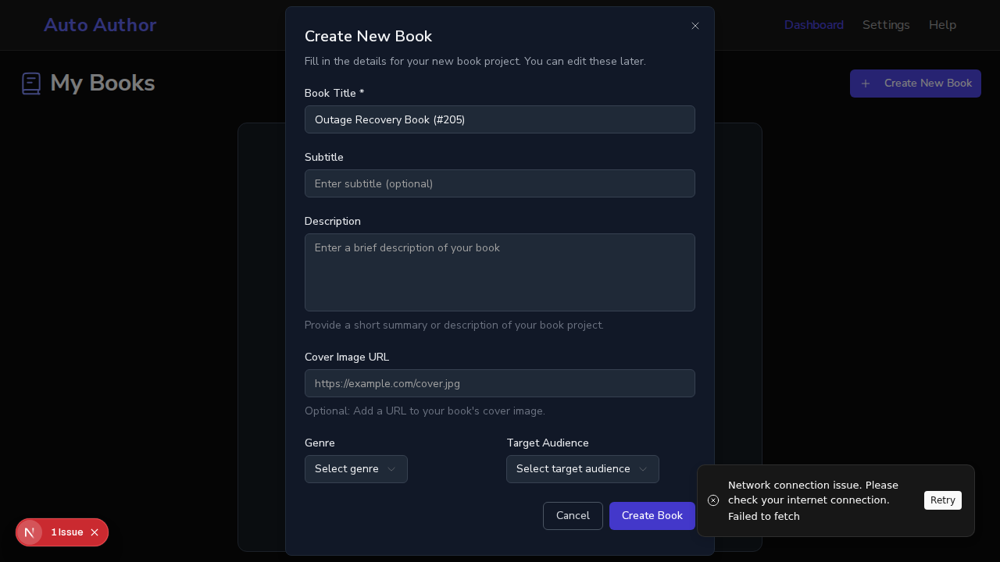

# Issue #205: orphaned /dashboard/new-book removed — genre/target-audience no longer silently dropped

*2026-07-13T20:46:37Z*

Setup: one real backend (uvicorn :8000, BYPASS_AUTH, real local MongoDB, CI-faithful env) shared by two frontends — the #205 branch on :3000 and a pristine main worktree on :3001. The orphaned page collected REQUIRED Genre and Target Audience fields (red asterisks) but its handleSubmit sent only {title, description} — silent data loss on every create. First: the route still resolves on main, and is gone on the branch.

```bash
echo "main   /dashboard/new-book -> HTTP $(curl -s -o /dev/null -w "%{http_code}" http://localhost:3001/dashboard/new-book)"; echo "branch /dashboard/new-book -> HTTP $(curl -s -o /dev/null -w "%{http_code}" http://localhost:3000/dashboard/new-book)"
```

```output
main   /dashboard/new-book -> HTTP 200
branch /dashboard/new-book -> HTTP 404
```

Live data-loss proof on main: fill the orphaned form — including the REQUIRED Genre and Target Audience — and submit.

```bash {image}
agent-browser screenshot /tmp/claude-1000/-home-frankbria-projects-auto-author/a6a6ce3f-8f39-4e32-95ae-a00c980a5e83/scratchpad/main-form-filled.png && echo /tmp/claude-1000/-home-frankbria-projects-auto-author/a6a6ce3f-8f39-4e32-95ae-a00c980a5e83/scratchpad/main-form-filled.png
```



The form accepted the required fields and redirected to the new book. But the backend document shows what was actually persisted — genre and target_audience are null. The required inputs were silently discarded.

```bash
curl -s http://localhost:8000/api/v1/books/6a554ed44a47b81dc020f6da | python3 -c "import json,sys; b=json.load(sys.stdin); print(json.dumps({k: b.get(k) for k in [\"title\",\"genre\",\"target_audience\"]}, indent=2))"
```

```output
{
  "title": "Demo Data Loss Book (#205 main)",
  "genre": null,
  "target_audience": null
}
```

On the #205 branch the route is gone (404 above); the sole creation flow is the BookCreationWizard modal on the dashboard. Same fields, same intent — this time they persist.

```bash {image}
agent-browser screenshot /tmp/claude-1000/-home-frankbria-projects-auto-author/a6a6ce3f-8f39-4e32-95ae-a00c980a5e83/scratchpad/branch-genre-options.png && echo /tmp/claude-1000/-home-frankbria-projects-auto-author/a6a6ce3f-8f39-4e32-95ae-a00c980a5e83/scratchpad/branch-genre-options.png
```



```bash {image}
agent-browser screenshot /tmp/claude-1000/-home-frankbria-projects-auto-author/a6a6ce3f-8f39-4e32-95ae-a00c980a5e83/scratchpad/branch-wizard-filled.png && echo /tmp/claude-1000/-home-frankbria-projects-auto-author/a6a6ce3f-8f39-4e32-95ae-a00c980a5e83/scratchpad/branch-wizard-filled.png
```



Wizard submit succeeded and redirected. The persisted document now carries both fields:

```bash
curl -s http://localhost:8000/api/v1/books/6a554f3e4a47b81dc020f6e1 | python3 -c "import json,sys; b=json.load(sys.stdin); print(json.dumps({k: b.get(k) for k in [\"title\",\"genre\",\"target_audience\"]}, indent=2))"
```

```output
{
  "title": "Demo Persisted Book (#205 branch)",
  "genre": "business",
  "target_audience": "professional"
}
```

Single source of truth (AC 2): the book-detail Edit form (BookMetadataForm) previously carried its own 7-item genre list, diverging from the wizard. On the branch both components consume the shared src/lib/constants/book-metadata.ts — the Edit form now offers the same canonical 11 genres (note Historical, Biography, Self-Help, Business — absent from its old local list):

```bash {image}
agent-browser screenshot /tmp/claude-1000/-home-frankbria-projects-auto-author/a6a6ce3f-8f39-4e32-95ae-a00c980a5e83/scratchpad/branch-metadata-genres.png && echo /tmp/claude-1000/-home-frankbria-projects-auto-author/a6a6ce3f-8f39-4e32-95ae-a00c980a5e83/scratchpad/branch-metadata-genres.png
```



For contrast, the SAME Edit form on main offers only its divergent 7-item local list (no Historical/Biography/Self-Help/Business), while the wizard offered 11 — the taxonomy drift the shared constants module resolves:

```bash
agent-browser snapshot -i | grep option
```

```output
- option "Fiction" [ref=e2]
- option "Non-Fiction" [ref=e3]
- option "Fantasy" [ref=e4]
- option "Science Fiction" [ref=e5]
- option "Mystery" [ref=e6]
- option "Romance" [ref=e7]
- option "Other" [ref=e8]
```

```bash
agent-browser snapshot -i | grep option
```

```output
- option "Fiction" [ref=e2]
- option "Non-Fiction" [ref=e3]
- option "Science Fiction" [ref=e4]
- option "Fantasy" [ref=e5]
- option "Mystery" [ref=e6]
- option "Romance" [ref=e7]
- option "Historical" [ref=e8]
- option "Biography" [ref=e9]
- option "Self-Help" [ref=e10]
- option "Business" [ref=e11] [selected]
- option "Other" [ref=e12]
```

Both live components now render the identical canonical list. Bonus round-trip proof: Business was pre-selected in the Edit form above because the wizard-persisted value hydrated it.

Finale — the error handling ported from the deleted page, live. The wizard previously showed a generic unclassified toast with no recovery action; it now routes failures through classifyError + showErrorNotification. And a bug this exposed: Radix modal dialogs set pointer-events:none on <body>, which made EVERY sonner toast action button unclickable while a dialog was open — the shared Toaster now forces pointerEvents:auto. Proof: kill the backend, submit the wizard, and recover via the toast Retry button while the dialog is still open.

```bash {image}
agent-browser screenshot /tmp/claude-1000/-home-frankbria-projects-auto-author/a6a6ce3f-8f39-4e32-95ae-a00c980a5e83/scratchpad/branch-toast-retry.png && echo /tmp/claude-1000/-home-frankbria-projects-auto-author/a6a6ce3f-8f39-4e32-95ae-a00c980a5e83/scratchpad/branch-toast-retry.png
```



```bash
agent-browser snapshot -i | grep -iE "retry|Book Title"
```

```output
- button "Retry" [ref=e1]
- textbox "Book Title *" [ref=e2]
```

TRANSIENT toasts auto-dismiss after 5s — faster than a backend restart — so the click-Retry-recovers proof runs as the CI E2E test (route-level network abort, toast Retry click over the open dialog, real book created on retry). Before the Toaster pointerEvents fix this exact test failed with "dialog-overlay intercepts pointer events"; now:

```bash
cd /home/frankbria/projects/auto-author/frontend && BYPASS_AUTH=true NEXT_PUBLIC_API_URL=http://localhost:8000/api/v1 npx playwright test --project=chromium src/e2e/error-recovery-flow.spec.ts -g "Retry action recovers" 2>&1 | tail -2 | sed "s/([0-9.]*s)/(Ns)/g"
```

```output
[1/1] [chromium] › src/e2e/error-recovery-flow.spec.ts:99:9 › Error Recovery Flow › book creation (no auto-retry, manual recovery) › network failure surfaces a retryable notification; the Retry action recovers
  1 passed (Ns)
```

Summary: the orphaned data-loss route is gone (404); the wizard persists genre/target_audience for real (Mongo-backed doc shown); both live components render the identical canonical taxonomy from the shared constants module; the wizard now surfaces classified, retryable errors; and toast action buttons work over modal dialogs app-wide. Full chromium E2E vs real backend: 74 passed / 7 skipped (1 pre-existing dev-mode-only responsive failure — Next.js dev-tools overlay, absent in CI prod builds). Frontend units: 116 suites, 2123 passed / 5 skipped. NB: the three agent-browser snapshot blocks are live-browser-session evidence and intentionally diff under `showboat verify` once the session is closed (#203 precedent).
