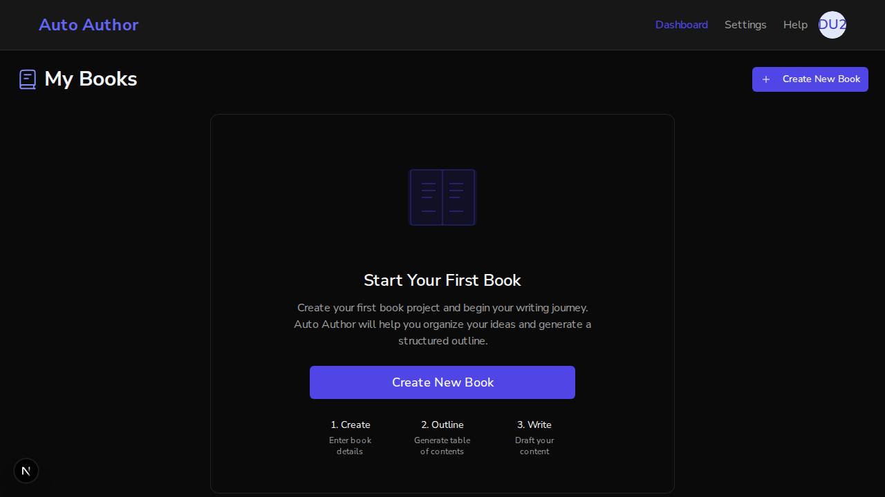
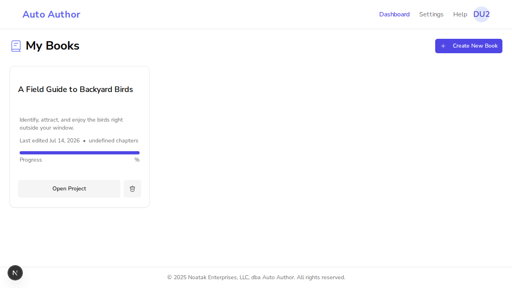
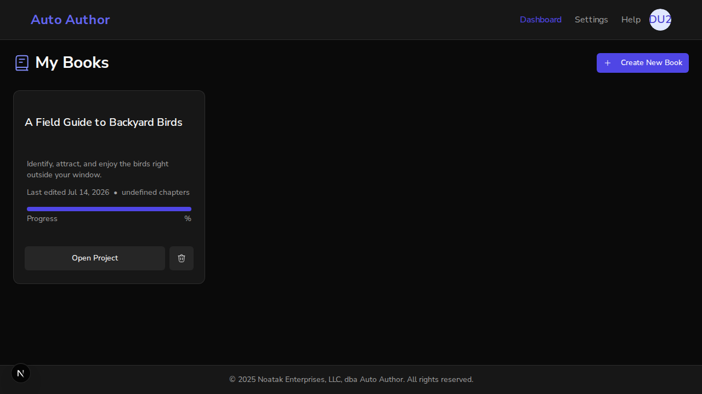
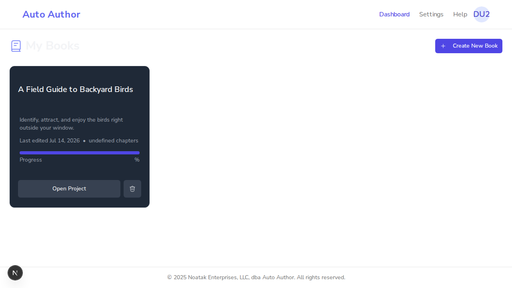

# Issue #206: BookCard + EmptyBookState respond to the theme (light mode fixed)

*2026-07-14T03:13:21Z*

Issue #206: the two surfaces a first-run user sees most — every book card and the empty-dashboard panel — hardcoded dark-theme classes (bg-gray-800, text-gray-400, bg-indigo-900/20, ...). Switching to Light theme rendered a half-themed dashboard: light header/footer over a dark book grid. This demo runs the branch frontend on :3000 and a pristine main worktree on :3001 against ONE shared real backend (:8000) + local MongoDB, with a genuine better-auth signup — same user, same book, both themes.

A fresh user (genuine better-auth signup) lands on the branch dashboard (:3000). Default theme is dark — the EmptyBookState panel in dark mode is the visual baseline; it must not regress.

```bash {image}
agent-browser screenshot /home/frankbria/projects/auto-author/docs/demos/issue206-branch-empty-dark.png && echo /home/frankbria/projects/auto-author/docs/demos/issue206-branch-empty-dark.png
```



Switch to Light (next-themes localStorage + reload; html class is now "light"). On the BRANCH the empty-state panel follows the theme: light card surface, dark text, muted step cards.

Demo-found bonus fix on the same screen: the dashboard page title "My Books" was itself hardcoded text-gray-100 (near-white — invisible on the light background). Fixed to text-foreground in the same PR. Re-captured:

```bash {image}
agent-browser screenshot /home/frankbria/projects/auto-author/docs/demos/issue206-branch-empty-light.png && echo /home/frankbria/projects/auto-author/docs/demos/issue206-branch-empty-light.png
```


MAIN (:3001, pristine worktree, same user, same Light theme): the EmptyBookState panel ignores the theme — a dark gray panel with light-gray text floats on the light dashboard. This is the #206 bug.

```bash {image}
agent-browser screenshot /home/frankbria/projects/auto-author/docs/demos/issue206-main-empty-light.png && echo /home/frankbria/projects/auto-author/docs/demos/issue206-main-empty-light.png
```


A real book (created through the BookCreationWizard, persisted to Mongo). BRANCH in Light: the BookCard is fully themed — white card surface, border-border edge, dark title, muted description/meta, bg-muted progress track with the fixed indigo brand fill, secondary-token buttons. NB "undefined chapters" / bare "%" is a PRE-EXISTING dashboard data bug (the books API returns no chapters/progress fields) — visible identically on main, filed as a follow-up; #206 is the styling layer only.

```bash {image}
agent-browser screenshot /home/frankbria/projects/auto-author/docs/demos/issue206-branch-card-light.png && echo /home/frankbria/projects/auto-author/docs/demos/issue206-branch-card-light.png
```



Dark-mode regression check on the BRANCH: the same card flips back to the dark token values — dark card surface, light title, muted-dark track. The brand indigo accents (progress fill, Create button) are fixed RGB and render identically in both themes, matching the old dark appearance.

```bash {image}
agent-browser screenshot /home/frankbria/projects/auto-author/docs/demos/issue206-branch-card-dark.png && echo /home/frankbria/projects/auto-author/docs/demos/issue206-branch-card-dark.png
```



MAIN (:3001), same user and book, Light theme: the BookCard stays hardcoded-dark — a dark gray card with light-gray text on the light dashboard, and the page title is invisible. Light header/footer over a dark book grid: the exact half-themed dashboard from the issue.

```bash {image}
agent-browser screenshot /home/frankbria/projects/auto-author/docs/demos/issue206-main-card-light.png && echo /home/frankbria/projects/auto-author/docs/demos/issue206-main-card-light.png
```



The migration is pinned by unit tests: 10 token-class tests (RED-verified against the old classes, mutation-verified for the two-tone brand text) plus a per-element sweep that bans gray-* literals outright and allows indigo-* only as a theme-responsive two-tone pair.

```bash
cd /home/frankbria/projects/auto-author/frontend && npx jest src/__tests__/components/BookCard.test.tsx src/__tests__/components/EmptyBookState.test.tsx 2>&1 | grep -E "Tests:|Suites:"
```

```output
Test Suites: 2 passed, 2 total
Tests:       26 passed, 26 total
```

```bash
grep -c "gray-[0-9]\|indigo-9" /home/frankbria/projects/auto-author/frontend/src/components/BookCard.tsx /home/frankbria/projects/auto-author/frontend/src/components/EmptyBookState.tsx || echo "zero theme-independent literals remain"
```

```output
/home/frankbria/projects/auto-author/frontend/src/components/BookCard.tsx:0
/home/frankbria/projects/auto-author/frontend/src/components/EmptyBookState.tsx:0
zero theme-independent literals remain
```

AC coverage: (1) literal gray-* classes replaced with theme tokens on both surfaces — grep shows zero remaining, sweep test enforces it; (2) light + dark verified live above: branch renders both themes correctly, main reproduces the half-dark bug, dark mode is regression-free. Brand text uses the repo two-tone precedent (text-indigo-600 dark:text-indigo-400/300) because `primary` is fixed indigo-600 and would be ~2.3:1 on dark surfaces (pre-PR codex Major, fixed).
