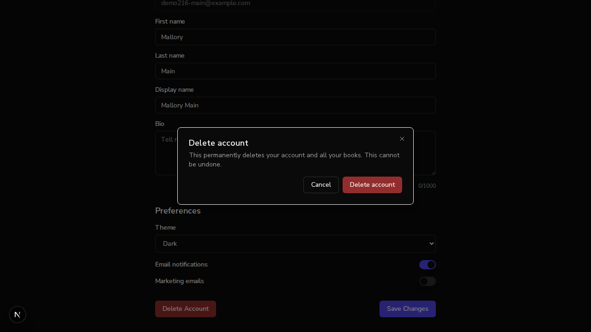
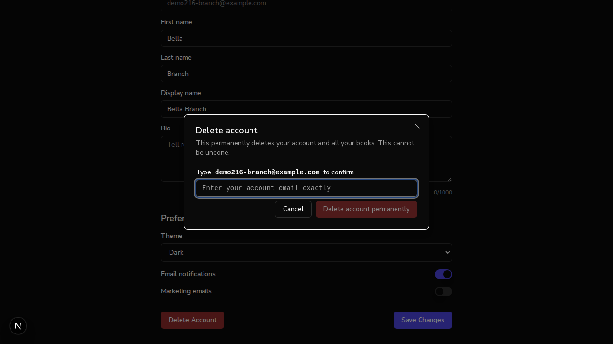
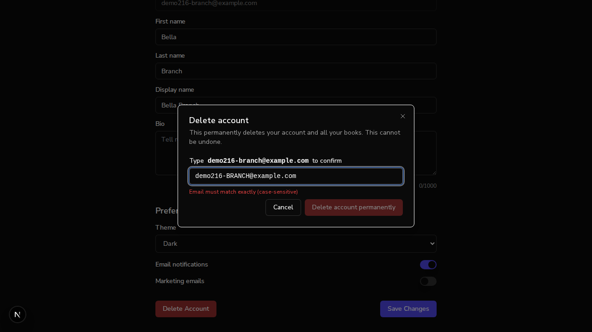
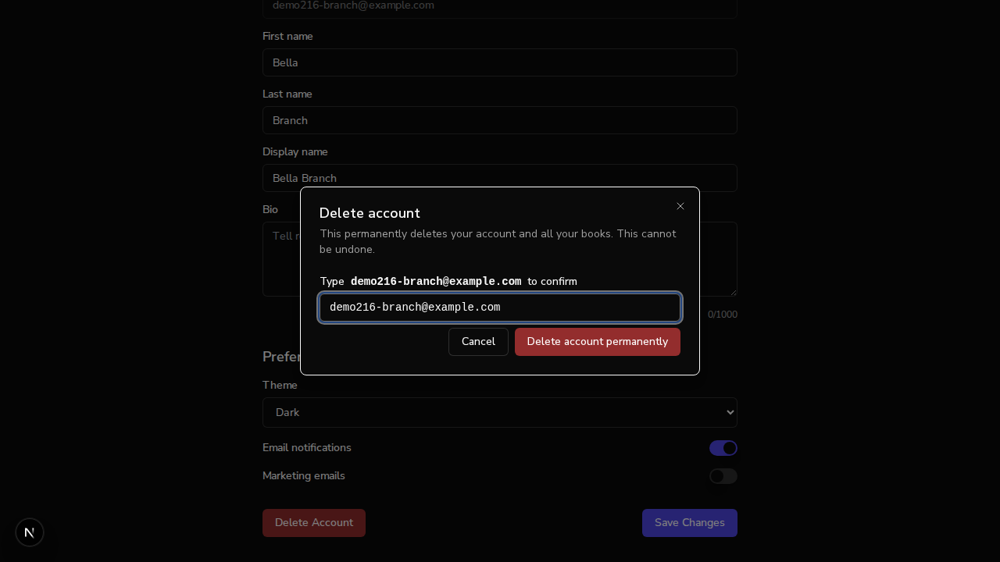

# Issue #216 — account deletion gets the type-to-confirm safeguard

*2026-07-14T21:06:04Z*

Setup: one real backend (uvicorn :8000) + local MongoDB, with TWO frontends against it — the fix branch on :3000 and a pristine main worktree on :3001. Real better-auth signups, no auth bypass. First, prove which code each server runs.

```bash
git -C /home/frankbria/projects/auto-author log --oneline -1 && git -C /tmp/claude-1000/-home-frankbria-projects-auto-author/13216ffa-7002-4c60-81ee-6ea29d5bf7d2/scratchpad/main-wt log --oneline -1
```

```output
54a4bb9 review: adopt GLM pre-PR minors — dismissal-guard parity, session-mock re-seed, E2E fallback note (#216)
abfb468 docs: CLAUDE.md changelog entry for #206 (PR #290)
```

PART 1 — the bug, live on main (:3001). Sign up a real user, then open Profile → Delete Account. On main the dialog is a plain Cancel/Delete: the destructive button is armed with zero friction.

```bash {image}
agent-browser screenshot /home/frankbria/projects/auto-author/docs/demos/216-main-dialog.png >/dev/null && echo docs/demos/216-main-dialog.png
```



```bash
agent-browser eval "(() => { const btns=[...document.querySelectorAll(\"button\")]; const del=btns.find(b=>/^Delete account$/.test(b.textContent.trim())); return {confirmationInputExists: !!document.getElementById(\"confirm-delete-account\"), deleteButtonDisabled: del.disabled}; })()"
```

```output
{
  "confirmationInputExists": false,
  "deleteButtonDisabled": false
}
```

No confirmation input exists on main and the destructive button is already enabled. One click now irreversibly deletes the account and every book in it:

```bash
mongosh --quiet auto_author --eval "const u=db.users.findOne({email:\"demo216-main@example.com\"}); print(JSON.stringify({email:u.email, is_active:u.is_active}))"
```

```output
{"email":"demo216-main@example.com","is_active":true}
```

A single click on the armed button — no typing, no second step — and the browser is back on the landing page. The account is now soft-deleted in Mongo:

```bash
mongosh --quiet auto_author --eval "const u=db.users.findOne({email:\"demo216-main@example.com\"}); print(JSON.stringify({email:u.email, is_active:u.is_active}))"
```

```output
{"email":"demo216-main@example.com","is_active":false}
```

PART 2 — the fix, live on the branch (:3000). Sign up a second real user and open the same dialog. The destructive button now starts disabled behind a type-to-confirm input.

```bash {image}
agent-browser screenshot /home/frankbria/projects/auto-author/docs/demos/216-branch-dialog-disabled.png >/dev/null && echo docs/demos/216-branch-dialog-disabled.png
```



```bash
agent-browser eval "(() => { const del=[...document.querySelectorAll(\"button\")].find(b=>b.textContent.trim()===\"Delete account permanently\"); return {confirmationInputExists: !!document.getElementById(\"confirm-delete-account\"), deleteButtonDisabled: del.disabled}; })()"
```

```output
{
  "confirmationInputExists": true,
  "deleteButtonDisabled": true
}
```

The exact inverse of main: the input exists and the button is disabled. A wrong phrase keeps it disabled and surfaces a case-sensitivity hint:

```bash {image}
agent-browser screenshot /home/frankbria/projects/auto-author/docs/demos/216-branch-mismatch.png >/dev/null && echo docs/demos/216-branch-mismatch.png
```



```bash
agent-browser eval "(() => { const del=[...document.querySelectorAll(\"button\")].find(b=>b.textContent.trim()===\"Delete account permanently\"); const err=document.getElementById(\"confirm-delete-account-error\"); return {typed: document.getElementById(\"confirm-delete-account\").value, deleteButtonDisabled: del.disabled, mismatchAlert: err ? err.textContent : null}; })()"
```

```output
{
  "deleteButtonDisabled": true,
  "mismatchAlert": "Email must match exactly (case-sensitive)",
  "typed": "demo216-BRANCH@example.com"
}
```

Typing the exact account email arms the button. Pre-delete Mongo state, then the confirmed deletion:

```bash
mongosh --quiet auto_author --eval "const u=db.users.findOne({email:\"demo216-branch@example.com\"}); print(JSON.stringify({email:u.email, is_active:u.is_active}))"
```

```output
{"email":"demo216-branch@example.com","is_active":true}
```

```bash {image}
agent-browser screenshot /home/frankbria/projects/auto-author/docs/demos/216-branch-armed.png >/dev/null && echo docs/demos/216-branch-armed.png
```



```bash
mongosh --quiet auto_author --eval "const u=db.users.findOne({email:\"demo216-branch@example.com\"}); print(JSON.stringify({email:u.email, is_active:u.is_active}))"
```

```output
{"email":"demo216-branch@example.com","is_active":false}
```

After the confirmed deletion the browser lands on the public landing page and the account is soft-deleted — same outcome as main, but now gated behind typing the account email. The 8-test unit suite pins the guard (disabled/mismatch/case, exactly-one-DELETE on double-submit, Escape blocked mid-delete, failure-path reset, Enter submit, profile-email fallback):

```bash
cd /home/frankbria/projects/auto-author/frontend && npx jest src/__tests__/ProfilePageDelete.test.tsx 2>&1 | grep -E "✓|✕|Tests:" | sed "s/ ([0-9]* ms)//"
```

```output
    ✓ disables the confirm button until the exact account email is typed
    ✓ enables on exact match; confirming sends DELETE /users/me and redirects home
    ✓ submits on Enter when the confirmation matches
    ✓ resets the confirmation when the dialog is cancelled and reopened
    ✓ sends exactly one DELETE on a rapid double-submit
    ✓ keeps the dialog open while deleting: Escape and outside clicks are blocked
    ✓ closes the dialog and clears the confirmation when the DELETE fails
    ✓ falls back to the hydrated profile email when the session has none
Tests:       8 passed, 8 total
```
