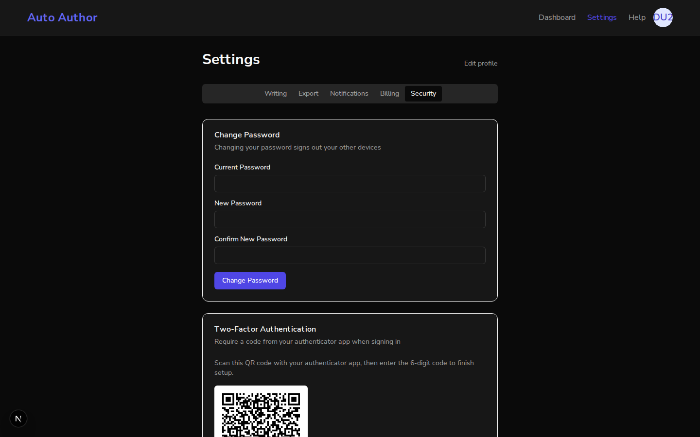
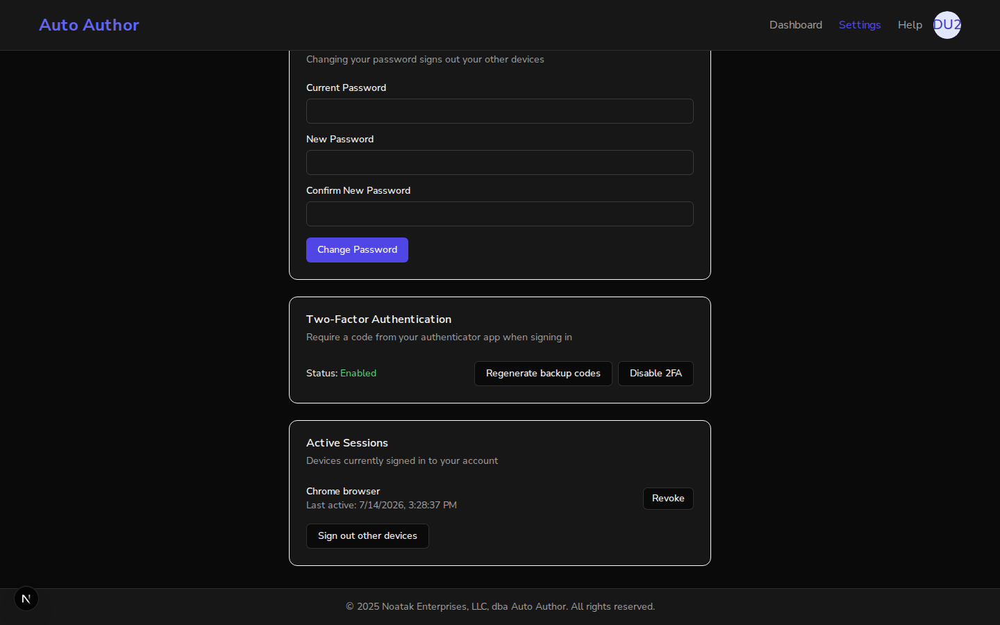
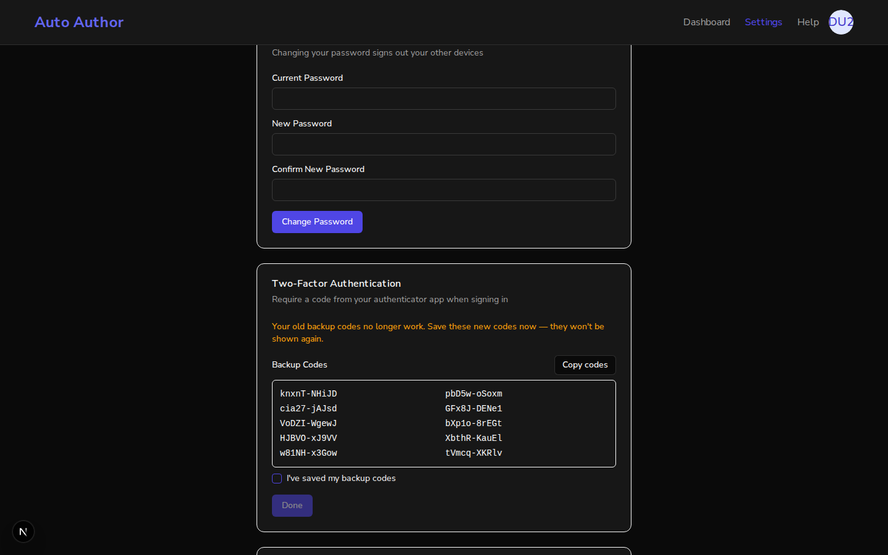
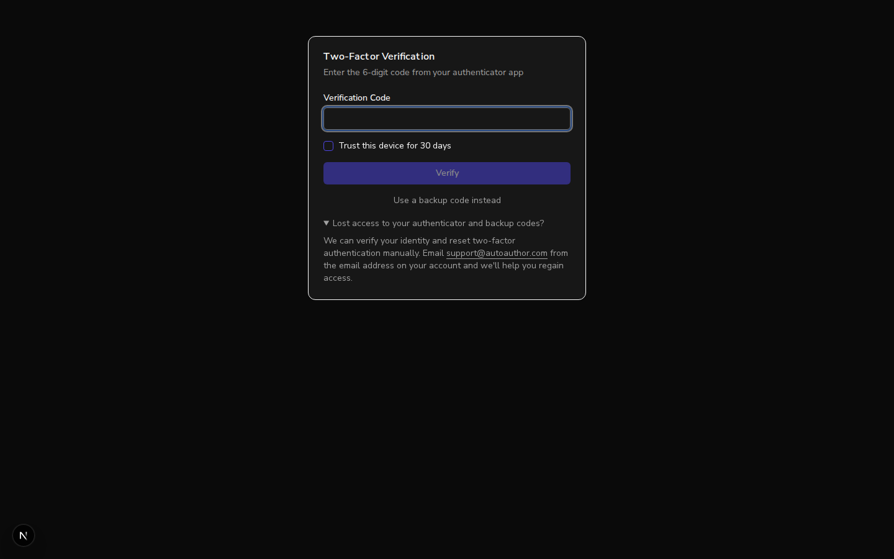
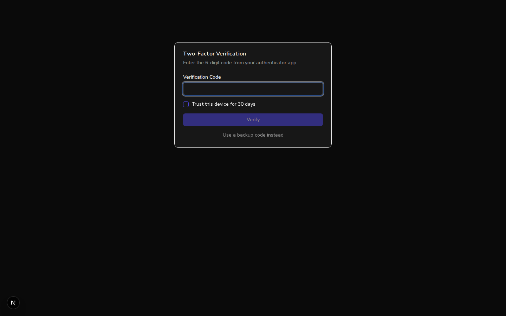
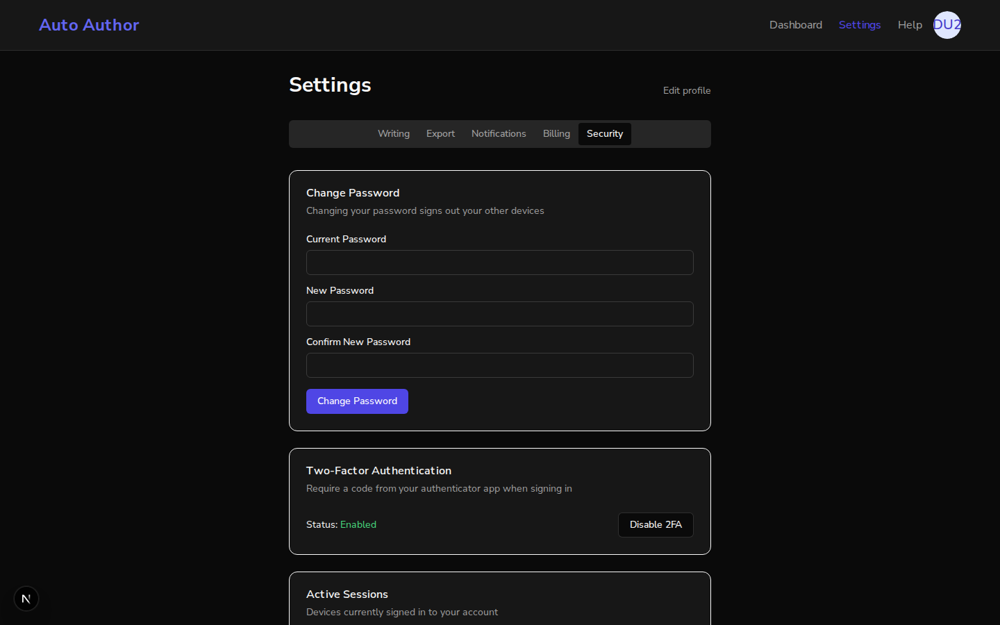
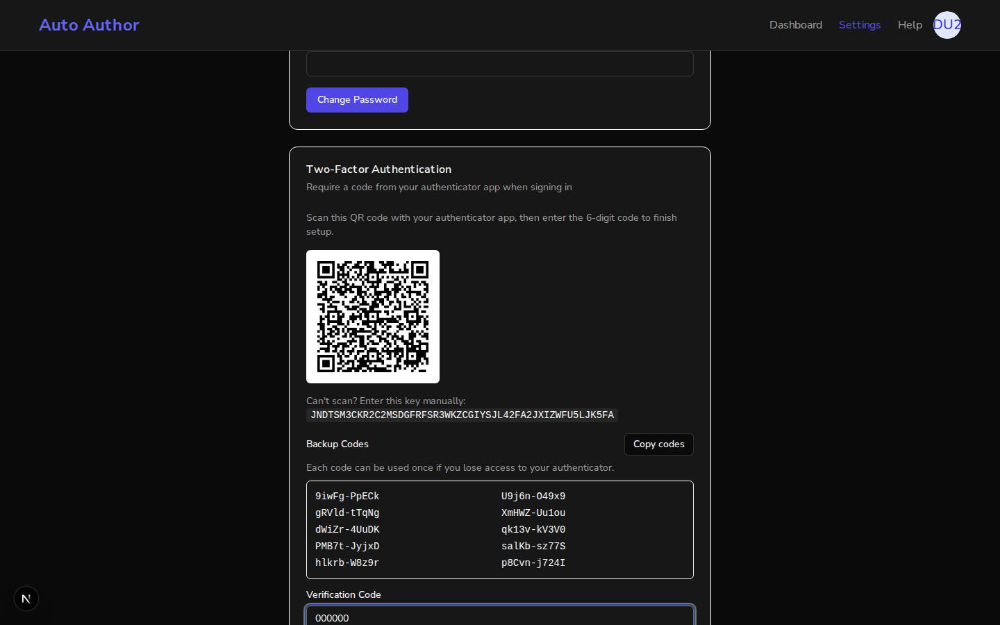

# Issue #217: 2FA backup-code regeneration, forced acknowledgment, and sign-in recovery path

*2026-07-14T22:25:01Z*

Setup: branch frontend (PR #293) on :3000, pristine main worktree on :3001, one shared real backend on :8000 with local MongoDB. All flows below use genuine better-auth signups/sessions and a real RFC-6238 TOTP implementation (stdlib Python) — no route mocking. Three servers healthy:

```bash
curl -s -o /dev/null -w "branch  :3000 -> %{http_code}\n" http://localhost:3000/auth/verify-2fa; curl -s -o /dev/null -w "main    :3001 -> %{http_code}\n" http://localhost:3001/auth/verify-2fa; curl -s -o /dev/null -w "backend :8000 -> %{http_code}\n" http://localhost:8000/api/v1/health
```

```output
branch  :3000 -> 200
main    :3001 -> 200
backend :8000 -> 200
```

PART 1 — Branch (:3000): a genuine better-auth signup, then the hardened enable flow. The verify step must now show a "won't be shown again" warning and keep Verify & Enable disabled until the user acknowledges saving their backup codes.

```bash {image}
echo issue217-branch-enable-gated.png
```



The enable verify step (screenshot above): backup codes are shown with the explicit "These codes won't be shown again after setup" warning and a new "I've saved my backup codes" acknowledgment. With a valid, freshly computed TOTP code already typed in, Verify & Enable is STILL disabled — the acknowledgment is the gate, not code completeness. Live accessibility-tree evidence with the code filled:

```bash
agent-browser snapshot -i | grep -iE "saved my backup codes|verify & enable"
```

```output
- checkbox "I've saved my backup codes" [ref=e18]
- button "Verify & Enable" [ref=e20] [disabled]
```

Checking the acknowledgment arms the button (no longer [disabled] in the tree). A stale TOTP window may have passed during capture, so the code is recomputed just before submitting; 2FA then enables for real against the shared backend.

```bash
agent-browser snapshot -i | grep -iE "verify & enable"
```

```output
- button "Verify & Enable" [ref=e20]
```

PART 2 — Regenerate backup codes. 2FA is now genuinely enabled (real TOTP verify against the backend). The enabled state offers the new "Regenerate backup codes" action:

```bash {image}
echo issue217-branch-enabled-actions.png
```



```bash {image}
echo issue217-branch-regenerated-codes.png
```



Password-gated regeneration succeeded (better-auth generateBackupCodes).
The screen warns "Your old backup codes no longer work" and — the codex pre-PR Major — Done is disabled until the same forced acknowledgment, because the old codes are already dead at this point:

```bash
agent-browser snapshot -i | grep -iE "saved my backup codes|Done"
```

```output
- checkbox "I've saved my backup codes" [ref=e18]
- button "Done" [ref=e19] [disabled]
```

PART 3 — Sign-in recovery path (AC2). Signing back in redirects to verify-2fa for real (the twoFactorRedirect flow). The page now carries a "Lost access to your authenticator and backup codes?" disclosure; expanding it reveals the support recovery instructions:

```bash {image}
echo issue217-branch-recovery-link.png
```



```bash
agent-browser eval "document.querySelector(\"details summary\").textContent.trim() + \" | \" + document.querySelector(\"details a\").href"
```

```output
"Lost access to your authenticator and backup codes? | mailto:support@autoauthor.com"
```

PART 4 — Outcome evidence: regeneration truly invalidated the old codes server-side. First, an OLD backup code (captured during enable, before regeneration) is submitted at sign-in — the backend rejects it:

```bash {image}
echo issue217-old-code-rejected.png
```


```bash
echo "submitted OLD code QZZSb-SZzEU:"; agent-browser get url; agent-browser snapshot | grep -oiE "Verification failed[^\"]*not valid." | head -1
```

```output
submitted OLD code QZZSb-SZzEU:
http://localhost:3000/auth/verify-2fa
```

The old code left the user on verify-2fa with a "Verification failed — that backup code is not valid" toast (screenshot above). Now a NEW code from the regenerated set — the backend accepts it and completes the session:

```bash
echo "submitted NEW code knxnT-NHiJD:"; agent-browser get url
```

```output
submitted NEW code knxnT-NHiJD:
http://localhost:3000/dashboard
```

Differential complete: same user, same sign-in flow — OLD code rejected, NEW code lands on /dashboard. Regeneration invalidates the previous set server-side, exactly what the "old codes no longer work" warning promises.

PART 5 — Pristine main worktree (:3001), same backend and Mongo. The verify-2fa page has no recovery path at all (no <details>, no support link):

```bash
agent-browser eval "JSON.stringify({details: document.querySelectorAll(\"details\").length, mailto: document.querySelectorAll(\"a[href^=mailto]\").length, lostAccessText: document.body.innerText.includes(\"Lost access\")})"
```

```output
"{\"details\":0,\"mailto\":0,\"lostAccessText\":false}"
```

```bash {image}
echo issue217-main-verify2fa-no-recovery.png
```



Same user signed in on main (consuming another regenerated code — they work on main too, same backend). Main's enabled state offers ONLY "Disable 2FA" — no way to view or regenerate backup codes:

```bash {image}
echo issue217-main-no-regenerate.png
```



```bash
agent-browser eval "JSON.stringify([...document.querySelectorAll(\"button\")].map(b=>b.textContent.trim()).filter(t=>/2FA|egenerate/i.test(t)))"
```

```output
"[\"Disable 2FA\"]"
```

And main's enable flow (fresh user demo217b): the moment any 6 digits are typed, "Verify & Enable" is armed — no "won't be shown again" warning, no acknowledgment checkbox anywhere on the page. One click past this screen and the codes are gone forever:

```bash {image}
echo issue217-main-enable-ungated.png
```



```bash
agent-browser eval "JSON.stringify({ackCheckbox: document.body.innerText.includes(\"saved my backup codes\"), warning: document.body.innerText.includes(\"shown again\"), verifyEnabled: !([...document.querySelectorAll(\"button\")].find(b=>/Verify & Enable/.test(b.textContent)).disabled)})"
```

```output
"{\"ackCheckbox\":false,\"warning\":false,\"verifyEnabled\":true}"
```

PART 6 — Test evidence. The 6 behavior pins were RED-verified at birth (5 failed pre-implementation; the regenerate-Done gate and the Enter-key submit-bypass pin each failed before their fixes). Mutation checks: stripping the ack gate from the button fails exactly the ack pin; short-circuiting the regenerate codes step fails exactly the regenerate pin. Full affected suites:

```bash
cd /home/frankbria/projects/auto-author/frontend && npx jest SecuritySettings VerifyTwoFactorPage --silent 2>&1 | grep -E "^(Tests|Test Suites):"
```

```output
Test Suites: 2 passed, 2 total
Tests:       20 passed, 20 total
```

Summary — every acceptance criterion demonstrated with outcome evidence: (1) Regenerate backup codes exists in the enabled state, is password-gated,
and truly invalidates the old set (old code rejected at sign-in, new code accepted — same backend, same user); (2) enable AND regenerate both force a "I've saved my backup codes" acknowledgment before proceeding, with the one-time-only warning explicit (also enforced in the submit handler against Enter-key bypass); (3) verify-2fa offers a "Lost access?" recovery disclosure with support instructions. Main has none of the three. NB: live-browser one-way state transitions (signups, code consumption) mean `showboat verify` will intentionally diff on those blocks — the #203 precedent.
