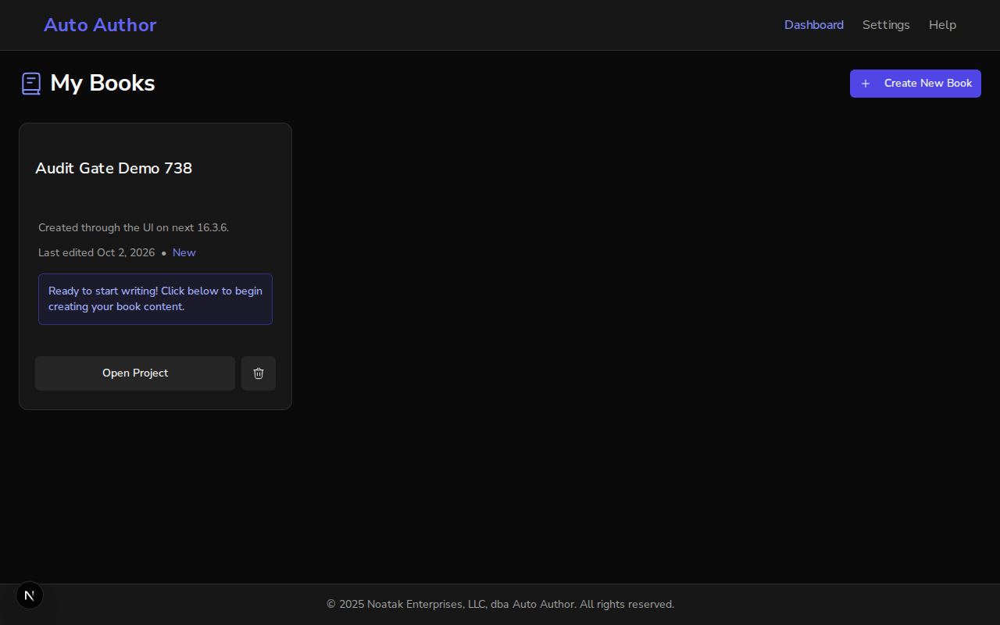

# Security Audit gate restored: Dependabot guards (#736) and six advisories (#738)

*2026-10-01T23:08:48Z by Showboat 0.6.1*
<!-- showboat-id: d4fd5f30-4acd-4f21-b3b8-4d60f47c5bb7 -->

Branch `fix/security-updates-group-guards` (PR #737). Every block compares `main` with the branch. `main`'s files come from `git archive main` into a scratch directory, so neither half depends on what is checked out.

## Criterion 1 — the Dependabot guards pass (#736)

`main`'s `dependabot.yml` is checked by `main`'s own guard tests, using CI's exact command:

```bash
T=$(mktemp -d); git archive main .github scripts | tar -x -C "$T"; (cd "$T" && uvx -q --with pytest --with pyyaml pytest scripts/test_dependabot_config.py -q -p no:cacheprovider 2>&1 | grep -E "^FAILED|passed|failed" | sed -E "s/ - AssertionError.*//"); rm -rf "$T"
```

```output
FAILED scripts/test_dependabot_config.py::test_shipping_groups_never_swallow_a_major[npm/frontend:security-updates]
FAILED scripts/test_dependabot_config.py::test_shipping_groups_never_swallow_a_major[uv/backend:security-updates]
FAILED scripts/test_dependabot_config.py::test_build_time_toolchains_never_ride_a_major_taking_group[/frontend:security-updates]
FAILED scripts/test_dependabot_config.py::test_better_auth_is_never_grouped[/frontend:security-updates]
4 failed, 9 passed, 4 skipped in 0.04s
```

The same guards on the branch:

```bash
uvx -q --with pytest --with pyyaml pytest scripts/ -q -p no:cacheprovider 2>&1 | grep -E "passed|failed"
```

```output
107 passed, 5 skipped in 1.82s
```

The new groups. The npm security group cannot take a major or better-auth. Per GitHub's options reference, such an update matches no group and opens as its own PR:

```bash
python3 -c "
import yaml
for e in yaml.safe_load(open(\".github/dependabot.yml\"))[\"updates\"]:
    g = e[\"groups\"][\"security-updates\"]
    print(e[\"package-ecosystem\"].ljust(15), \"update-types=\", g.get(\"update-types\", \"ALL (exempt)\"), \" exclude=\", g.get(\"exclude-patterns\", []))
"
```

```output
npm             update-types= ['minor', 'patch']  exclude= ['better-auth']
uv              update-types= ['minor', 'patch']  exclude= []
github-actions  update-types= ALL (exempt)  exclude= []
```

## Criterion 2 — the supply-chain gate reports no new advisories (#738)

`scripts/audit_gate.py` is fed exactly what CI feeds it: `pip-audit` over `uv export --all-extras`, and `npm audit`. Here it runs on `main`'s two lockfiles:

```bash
REF=main; T=$(mktemp -d)
git archive "$REF" scripts security-baseline.json frontend/package.json frontend/package-lock.json backend/pyproject.toml backend/uv.lock | tar -x -C "$T"
(cd "$T/backend" && uv export -q --all-extras --no-emit-project --format requirements-txt > "$T/reqs.txt" && uvx -q pip-audit -r "$T/reqs.txt" --format=json -o "$T/pip.json" >/dev/null 2>&1)
(cd "$T/frontend" && npx -y npm@11.19.0 audit --package-lock-only --json > "$T/npm.json" 2>/dev/null)
python3 "$T/scripts/audit_gate.py" --pip-audit "$T/pip.json" --npm-audit "$T/npm.json" --baseline "$T/security-baseline.json" | grep -vE "^\s*$|PYSEC-2026-2132|^Resolved"
rm -rf "$T"
```

```output
Scanned 7 advisories against /tmp/tmp.JSW7C6UEkX/security-baseline.json
New advisories not in the baseline (6):
  [npm] GHSA-6j4f-fj2g-mc7p  brace-expansion  severity=high  fix=yes
  [npm] GHSA-qhr7-859c-m2p7  brace-expansion  severity=high  fix=yes
  [npm] GHSA-vcvr-r3jv-pc5j  next  severity=critical  fix=yes
  [pypi] PYSEC-2026-4175  urllib3  severity=unknown  fix=2.8.0
  [pypi] PYSEC-2026-4176  urllib3  severity=unknown  fix=2.8.0
  [pypi] PYSEC-2026-4177  urllib3  severity=unknown  fix=2.8.0
FAIL — fix these, or add each ID to the baseline with a reason if it is accepted debt.
```

The same gate, on the branch's lockfiles:

```bash
REF=fix/security-updates-group-guards; T=$(mktemp -d)
git archive "$REF" scripts security-baseline.json frontend/package.json frontend/package-lock.json backend/pyproject.toml backend/uv.lock | tar -x -C "$T"
(cd "$T/backend" && uv export -q --all-extras --no-emit-project --format requirements-txt > "$T/reqs.txt" && uvx -q pip-audit -r "$T/reqs.txt" --format=json -o "$T/pip.json" >/dev/null 2>&1)
(cd "$T/frontend" && npx -y npm@11.19.0 audit --package-lock-only --json > "$T/npm.json" 2>/dev/null)
python3 "$T/scripts/audit_gate.py" --pip-audit "$T/pip.json" --npm-audit "$T/npm.json" --baseline "$T/security-baseline.json" | grep -vE "^\s*$|PYSEC-2026-2132|^Resolved"
rm -rf "$T"
```

```output
Scanned 1 advisories against /tmp/tmp.BVQziKeUOx/security-baseline.json
PASS — no new advisories (1 known, already in the baseline).
```

Each resolved version against its advisory's vulnerable range (from the GitHub advisory database and OSV):

```bash
cd frontend && echo "next            $(jq -r ".packages[\"node_modules/next\"].version" package-lock.json)   vulnerable >=16.2.0 <16.3.6"; jq -r ".packages|to_entries[]|select(.key|endswith(\"/brace-expansion\"))|.value.version" package-lock.json | sort -uV | sed "s/^/brace-expansion /;s/$/   (patched 1.1.20 \/ 2.1.6 \/ 5.0.11)/"; cd ../backend && echo "urllib3         $(grep -A1 "^name = \"urllib3\"" uv.lock | sed -n "s/version = \"\(.*\)\"/\1/p")   vulnerable <2.8.0"
```

```output
next            16.3.6   vulnerable >=16.2.0 <16.3.6
brace-expansion 1.1.21   (patched 1.1.20 / 2.1.6 / 5.0.11)
brace-expansion 2.1.7   (patched 1.1.20 / 2.1.6 / 5.0.11)
brace-expansion 5.0.12   (patched 1.1.20 / 2.1.6 / 5.0.11)
urllib3         2.8.0   vulnerable <2.8.0
```

## Criterion 3 — the app runs on next 16.3.6

A version bump is only verified when the shipped framework still serves the app. This is the real stack: FastAPI on a scratch MongoDB database (`demo_738`, never the Atlas URI in `backend/.env`), and the frontend on the branch's `node_modules`. Auth bypass is active, gated by `E2E_ALLOW_BYPASS=1`.

```bash
echo "installed next: $(node -p "require(\"./frontend/node_modules/next/package.json\").version")"; curl -s http://127.0.0.1:8000/api/v1/health; echo
```

```output
installed next: 16.3.6
{"status":"healthy","checks":{"mongodb":"ok","config":"ok"}}
```

Playwright drives the UI: open the dashboard, click **Create New Book**, fill the dialog, submit. Then reload the dashboard and find the new book:

```bash
cd frontend && node .demo-create-book.mjs /tmp/demo-738.png 738 2>&1
```

```output
POST /api/v1/books -> 201 id=6abee84f4fd3044b1a1f7924 title="Audit Gate Demo 738"
dashboard lists the new book: true
uncaught page errors: 0
```

The row the UI wrote, read straight from MongoDB:

```bash
mongosh --quiet demo_738 --eval 'db.books.find({}, {_id: 0, title: 1, description: 1, owner_id: 1}).toArray()'
```

```output
[
  {
    title: 'Audit Gate Demo 738',
    description: 'Created through the UI on next 16.3.6.',
    owner_id: 'test-auth-id'
  }
]
```

```bash {image}

```



## Evidence summary

| Criterion | Action | Outcome evidence | Status |
|---|---|---|---|
| #736: Dependabot guards pass | CI's pytest command on `main`'s files, then on the branch | `main`: the 4 named security-updates failures. Branch: 107 passed, 0 failed | VERIFIED |
| #736: security majors and better-auth stay out of the batch | dump the three `security-updates` groups | npm and uv take minor/patch only; npm excludes better-auth; github-actions exempt | VERIFIED |
| #738: no new advisories | `audit_gate.py` with CI's inputs, `main` vs branch | `main`: FAIL on the 6 IDs CI reported. Branch: PASS, nothing new | VERIFIED |
| #738: each fix is outside its vulnerable range | resolved versions from both lockfiles | next 16.3.6; brace-expansion 1.1.21 / 2.1.7 / 5.0.12; urllib3 2.8.0 | VERIFIED |
| #738: the app still works on next 16.3.6 | create a book through the dialog on the real stack | POST 201; the row is in MongoDB with the typed title and description; the dashboard lists it; 0 page errors | VERIFIED |
