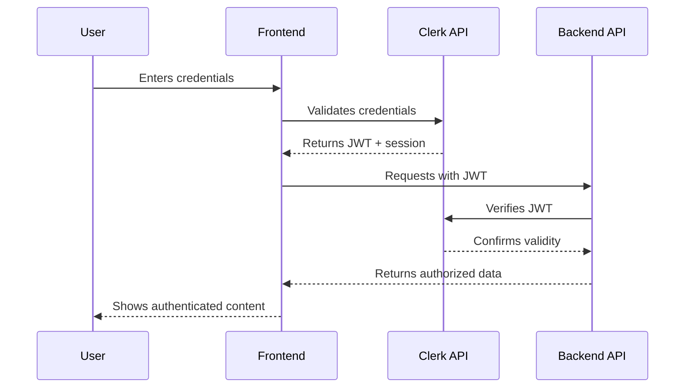
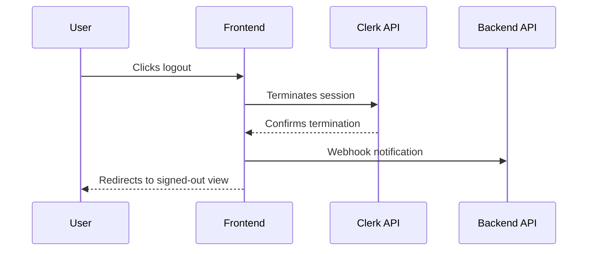

# Login & Logout Flows in Auto Author

This document explains the authentication flows and configuration for login and logout processes in Auto Author.

## Architecture Overview

Auto Author implements authentication using [Clerk](https://clerk.dev/), with:

- **Frontend**: Next.js with Clerk components and hooks
- **Backend**: FastAPI with Clerk JWT verification
- **Communication**: JWT tokens for authenticated API requests

## Login Flow

### 1. User Initiates Login

Users can log in through:
- Email/password combination
- Social authentication providers (Google, GitHub, Microsoft)
- Magic links (passwordless email login)

### 2. Authentication Process

### 3. Session Establishment

Upon successful authentication:
- Clerk creates a session with configurable expiration
- Session token is stored securely in browser storage
- User is redirected to configured post-login route (`/dashboard`)

### 4. "Remember Me" Functionality

When enabled:
- Sessions persist for extended periods (up to 30 days)
- User remains logged in across browser sessions
- Configured through Clerk session settings

## Logout Flow

### 1. User Initiates Logout

Users can log out by:
- Clicking the logout button in the navbar
- Using the account menu logout option
- Session expiration (automatic logout)

### 2. Logout Process

### 3. Post-Logout Actions

After logout:
- User session is invalidated immediately
- User is redirected to the home page
- Webhook events trigger backend cleanup if configured
- Protected routes become inaccessible

## Multi-Device Session Management

Auto Author supports concurrent sessions across multiple devices:

- Each device maintains its own session
- Sessions can be viewed and managed in user settings
- Suspicious sessions can be terminated by the user
- Admin can force logout specific user sessions

## Configuration Options

### Environment Variables

Key Clerk configuration settings:

| Variable | Purpose |
|----------|---------|
| `NEXT_PUBLIC_CLERK_PUBLISHABLE_KEY` | Frontend authentication |
| `CLERK_SECRET_KEY` | Backend verification |
| `NEXT_PUBLIC_CLERK_SIGN_IN_URL` | Custom login page path |
| `NEXT_PUBLIC_CLERK_AFTER_SIGN_IN_URL` | Post-login redirect |
| `NEXT_PUBLIC_CLERK_AFTER_SIGN_OUT_URL` | Post-logout redirect |

### Session Duration Settings

Session lifetimes can be configured in the Clerk dashboard:

- **Short sessions**: 1-24 hours (high security)
- **Standard sessions**: 1-7 days (balanced approach)
- **Extended sessions**: 7-30 days (with "Remember Me")

### Custom Redirect Rules

To modify login/logout redirects:
1. Update environment variables in `.env` files
2. Or use dynamic redirects in code for context-aware navigation

## Related Documentation

- [Authentication Troubleshooting Guide](./auth-troubleshooting.md)
- [Session Management Strategies](./session-management.md)
- [API Authentication Documentation](./api-auth-endpoints.md)
