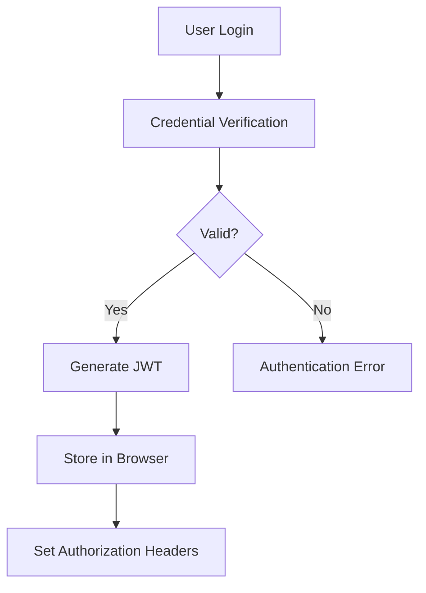

# Session Management Strategies

This document outlines the session management approaches used in Auto Author, providing guidance for both developers and system administrators.

## Overview

Auto Author implements a robust session management system using better-auth, a TypeScript-first authentication framework integrated with our FastAPI backend. This provides secure, scalable, and user-friendly authentication across all application components.

## Session Architecture


### Session Components

1. **JWT Tokens**: JSON Web Tokens that encode user identity and permissions
2. **Browser Storage**: Secure storage of session information in the client
3. **Backend Validation**: Server-side verification of session validity
4. **Refresh Mechanism**: Automatic renewal of sessions when appropriate

## Session Lifecycle

### Creation

Sessions are created through:

1. **User Login**: Email/password or social authentication
2. **API Authentication**: Backend verification of credentials
3. **Token Generation**: Creation of signed JWT with user claims
4. **Storage**: Secure storage in browser with appropriate security flags



### Maintenance

Sessions are maintained through:

1. **Token Refresh**: Automatic renewal before expiration
2. **Active Usage Tracking**: Session prolonging based on activity
3. **Remember Me**: Extended sessions for trusted devices
4. **Inactivity Detection**: Timeout after periods of inactivity

### Termination

Sessions can be terminated via:

1. **Manual Logout**: User-initiated session end
2. **Expiration**: Time-based automatic termination
3. **Security Events**: Force logout on suspicious activity
4. **Admin Action**: Administrator-forced session termination

## Session Duration Strategies

Auto Author employs different session duration strategies to balance security and convenience:

### Default Sessions

- **Duration**: 24 hours
- **Use Case**: Standard web application usage
- **Renewal**: Automatic refresh when 80% of lifetime elapsed
- **Storage**: HTTP-only, secure cookies

### Remember Me Sessions

- **Duration**: 30 days
- **Use Case**: Trusted personal devices
- **Renewal**: Background refresh while active
- **Storage**: Combination of HTTP-only cookies and localStorage
- **Additional Security**: Device fingerprinting

### Short-lived API Sessions

- **Duration**: 15 minutes
- **Use Case**: API-only interactions
- **Renewal**: Client must explicitly refresh
- **Storage**: Bearer token in Authorization header

## Multi-Device Session Management

Auto Author supports concurrent sessions across multiple devices with:

### Session Inventory

- Users can view all active sessions in their account settings
- Each session shows device details, location, and last activity
- Suspicious sessions can be individually terminated

### Session Synchronization

- Critical account changes propagate across all sessions
- Permission changes take effect on all devices
- Forced logout can target specific devices or all sessions

## Security Measures

### Token Security

- **Signing**: HS256 algorithm with shared secret (BETTER_AUTH_SECRET)
- **Claims**: Minimal necessary user data and permissions
- **Verification**: Backend validation on every request
- **Expiration**: Short timeframes with explicit renewal

### Protection Against Common Attacks

1. **CSRF Protection**: 
   - Double-submit cookie pattern
   - State parameter in auth flows
   - Same-site cookie attributes

2. **Session Hijacking Prevention**:
   - HTTP-only cookies
   - Secure flag requiring HTTPS
   - Browser fingerprint validation

3. **Session Fixation Defense**:
   - New session generation after authentication
   - Session rotation on privilege changes

## Configuration Options

### Core Authentication Settings

Essential better-auth environment variables:

```bash
# Authentication secret (required) - used for HS256 JWT signing
BETTER_AUTH_SECRET=your-secret-key-min-32-chars

# Base URL for your application
BETTER_AUTH_URL=http://localhost:3000

# Database connection (MongoDB)
DATABASE_URL=mongodb://localhost:27017/auto_author
DATABASE_NAME=auto_author
```

### Session Timeouts

Session configuration is defined in `src/lib/auth.ts`:

```typescript
session: {
  expiresIn: 60 * 60 * 24 * 7,  // 7 days (604,800 seconds)
  updateAge: 60 * 60 * 24,       // Refresh every 24 hours
  cookieCache: {
    enabled: true,
    maxAge: 5 * 60,              // Cache for 5 minutes
  },
}
```

### Cookie Settings

Session cookie configuration in `src/lib/auth.ts`:

```typescript
advanced: {
  defaultCookieAttributes: {
    sameSite: "lax",                              // CSRF protection
    secure: process.env.NODE_ENV === "production", // HTTPS only in production
    httpOnly: true,                               // Prevent XSS attacks
  },
}
```

### Rate Limiting

Better-auth provides built-in rate limiting through middleware.
Configure additional protection in `src/middleware.ts` as needed.

## Developer Usage

### Frontend Session Management

```typescript
// Check authentication state
import { useSession } from '@/lib/auth-client';

export function MyComponent() {
  const { data: session, isPending } = useSession();

  if (isPending) {
    return <div>Loading...</div>;
  }

  if (!session) {
    return <div>Please sign in</div>;
  }

  return <div>Welcome, {session.user.name || session.user.email}</div>;
}
```

### Backend Session Verification

```python
from fastapi import Depends
from app.core.security import get_current_user

@router.get("/protected-endpoint")
async def protected_endpoint(current_user = Depends(get_current_user)):
    return {"message": f"Hello, {current_user['email']}"}
```

## Monitoring and Debugging

### Session Logs

Key events logged for audit and debugging:

- Session creation
- Session renewal
- Failed authentication attempts
- Session termination
- Suspicious activity detection

Log format:
```json
{
  "event": "session.created",
  "timestamp": "2023-04-15T14:22:33Z",
  "userId": "user_2xAmple5tring",
  "sessionId": "sess_1xAmple5tring",
  "ipAddress": "192.168.1.1",
  "userAgent": "Mozilla/5.0...",
  "deviceId": "device_3xAmple5tring"
}
```

### Metrics

Session health metrics collected:

- Active sessions count
- Session renewal rate
- Failed login attempts
- Session expiration rate
- Average session duration

## Best Practices

1. **Regular Rotation**: Rotate signing keys on a scheduled basis
2. **Minimal Payload**: Keep JWT claims small for performance
3. **Layered Security**: Don't rely on JWT alone for sensitive operations
4. **Stateful Security Events**: Track important security events server-side
5. **Clear on Logout**: Ensure complete session cleanup on termination

## Related Documentation

- [Login/Logout Flows](./login-logout-flows.md)
- [Authentication Troubleshooting](./auth-troubleshooting.md)
- [API Authentication Documentation](./api-auth-endpoints.md)
